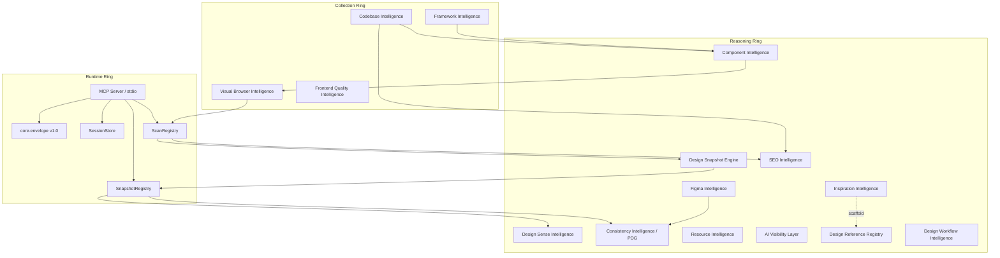

# Report 01 — MCP Module Inventory

This report is the ground-truth reference for what the Frontend Perception MCP can and cannot do today. Every subsequent state-space artifact cites it when justifying `mcp_ready`, module eligibility, or evidence posture.

Sources: `docs/INTELLIGENCE_MODULES.md`, `docs/architecture.md`, `docs/roadmap.md`, `docs/features/*`, `AGENT_GUIDE.md`, `src/navigation/mcp/tools.py`, `src/navigation/mcp/handlers.py`, `src/navigation/mcp/design_intelligence_handlers.py`, `src/navigation/mcp/server.py`, each module's `service.py` and `docs/`, `docs/PRODUCTION_TEST_PLAN.md`.

---

## 1. System topology

Three concentric rings:

- **Runtime ring** — the shared MCP fabric that owns process state.
- **Collection ring** — modules that gather primary evidence.
- **Reasoning ring** — modules that interpret evidence and propose changes.

## 2. Envelope contract (universal invariant)

Every tool returns a `contract v1.0` envelope from `core/envelope.py`. Fields:

- `contract_version: "1.0"`
- `tool: <name>`
- `ok: bool`
- `session_id | run_id | scan_id | url` (as applicable)
- `error` (present iff `ok=false`)
- `degraded: []` (graceful-fallback notes)
- `data: {}`

**State-space consequence:** every action edge produces a check on the envelope. A state can never be entered because of "success" alone — the recipient always inspects `degraded[]` and `data.agent_summary` to decide the next state.

## 3. Runtime artifacts (evidence anchors)

| Artifact | ID format | Producer | Consumers | Lifetime |
|----------|-----------|----------|-----------|----------|
| `session_id` | `sess_{12hex}` | `perception_session_start` | Every browser tool | Session (killed on `session_end` or server shutdown) |
| `run_id` | `run_0001..N` | Auto-incremented per observe/act cycle | Envelope metadata | Session |
| `scan_id` | `scan_{12hex}` | `perception_navigate_and_observe`, `perception_observe`, verify-fail, diagnosis modes | `perception_diff`, `perception_build_design_snapshot`, `perception_seo_audit`, `perception_resource_observe_bridge` | Session (until `end_all`) |
| `snapshot_id` | `snap_{12hex}` | `perception_build_design_snapshot` | `perception_design_review`, `perception_consistency_*` | Session |
| `audit_id` | `audit_{16hex}` | `perception_seo_audit` | SEO graph, `perception_seo_verify` | Persistent (in `.cache/seo_graph.json`) |
| `evidence_id` | `ev:{provider}:{kind}:{fp}` | SEO providers | Recommendations, graph queries, `reasoning_units` | Persistent |
| `reasoning_context_v2` | JSON object, schema `2.0` | SEO audit pipeline | Host LLM, `perception_seo_verify` | Persistent (per audit) |
| PDG | `.perception/design_graph.json` | `perception_design_graph_refresh` | `perception_design_knowledge_query` | Persistent |
| SEO graph | `.cache/seo_graph.json` | `perception_seo_audit` | `perception_seo_query`, `perception_seo_verify` | Persistent |
| `FigmaDesignContext` | Normalized dict | `perception_figma_context` | Design/Consistency/Component consumers | Session or cached |
| Blob sessions | `insp_*`, `res_*` | Inspiration/Resource collect | `session_end` cleanup | Ephemeral (TTL) |

**State-space consequence:** artifacts represent evidence, not identity. Two states can share the same `scan_id` and be different states.

---

## 4. Modules — per-module runbook

Each entry answers the six state-space questions:
1. **Purpose** — what agent goal it advances
2. **Inputs** — what must exist for it to run
3. **Outputs** — what evidence or artifact it produces
4. **When to run** — semantic triggers
5. **When NOT to run** — anti-patterns that inform `modules_must_not_execute`
6. **Cross-module dependencies** — bridges

### 4.1 Visual Browser Intelligence

**Path:** `src/navigation/visual_browser_intelligence/`
**Maturity:** Production.
**MCP tools:** `perception_navigate`, `perception_navigate_and_observe`, `perception_observe`, `perception_execute_script`, `perception_execute_actions`, `perception_verify`, `perception_diff`.

- **Purpose:** Ground truth about the live UI — DOM, a11y tree, console, network, screenshot, visual insights.
- **Inputs:** `session_id` (session_start first), reachable dev server or URL.
- **Outputs:** `scan_id` with `PageObservation`, `agent_summary.blocking`/`advisory`, inline PNG attachments.
- **Run when:** any UI change, verification, debugging, before design snapshot, before SEO/browser evidence collection.
- **Do NOT run when:** dev server unreachable (call `perception_health` first), auth wall pending (call `auth_gate` first), no session (call `session_start`).
- **Cross-module:** feeds SEO (`scan_id` → rendering evidence), Design Snapshot (scan → snapshot), Resource (observe bridge), Consistency (fragments via snapshot).

### 4.2 Frontend Quality Intelligence

**Path:** `src/navigation/frontend_quality_intelligence/`
**Maturity:** Production. Lighthouse-dependent audits degrade cleanly if `npx lighthouse` unavailable.
**MCP tools:** `perception_console_get/clear`, `perception_network_get/clear`, `perception_audit_accessibility/performance/seo/best_practices`, `perception_audit_mode`, `perception_debug_mode`, `perception_full_diagnosis`.

- **Purpose:** Console/network buffers, Lighthouse audits, structured diagnosis reports.
- **Inputs:** `session_id`; audits additionally need Lighthouse CLI (Node 18+).
- **Outputs:** ConsoleReport, NetworkReport, LighthouseAudit(s), `PerceptionReport` (debug/audit/full modes), HAR resource at `perception://scan/{scan_id}/network.har`.
- **Run when:** blocking issues observed, quality campaign (a11y/perf/SEO), pre-release regression, agent needs HAR.
- **Do NOT run when:** Lighthouse unavailable → skip audits, do not block (`degraded: ["lighthouse_unavailable"]`); heavy audits during rapid iteration.
- **Cross-module:** `perception_audit_seo` here is Lighthouse's SEO checks — distinct from SEO Intelligence's `perception_seo_audit`. Both may run and give different verdicts.

### 4.3 Codebase Intelligence

**Path:** `src/navigation/codebase_intelligence/`
**Maturity:** Production for stats and route lookup; deeper search is heuristic.
**MCP tools:** `perception_code_context`.

- **Purpose:** Repo graph — stats, search, get_route.
- **Inputs:** `repo_root` (must be a real path); auto-detected via `_default_repo_root`.
- **Outputs:** `code_context` payload; used by SEO enrichment (`codebase_hints`, `browser_code_links`) and Component orchestrator.
- **Run when:** before opening a page (route lookup), before SEO audit with `repo_root` set, before component selection needing local convention hints.
- **Do NOT run when:** repo path missing/invalid — early-return with `error`.
- **Cross-module:** SEO cross-module (`reasoning/codebase_bridge.py`), Component contracts (`CodebaseIntelligenceContract`).

### 4.4 Framework Intelligence

**Path:** `src/navigation/framework_intelligence/`
**Maturity:** Production. Grounded Docs adapter degrades if the CLI is unavailable.
**MCP tools:** `perception_detect_framework`, `perception_framework_docs`.

- **Purpose:** Stack detection (framework, build tool, package manager) and version-aware documentation fetch.
- **Inputs:** `repo_root` (detection); `topic` and `repo_root` (docs).
- **Outputs:** `FrameworkMetadata`, `FrameworkKnowledgeResponse` (with cache flags).
- **Run when:** first entry to a new repo, when component search needs framework hints, when docs are required for an API.
- **Do NOT run when:** Grounded Docs offline → return `degraded: ["docs_provider_unavailable"]` (agent still receives envelope).
- **Cross-module:** feeds Component's `FrameworkIntelligenceContract`.

### 4.5 Component Intelligence

**Path:** `src/navigation/component_intelligence/`
**Maturity:** Search + planning + foundation selection are production; integration is orchestrated but defaults to `execute_install=false` and `execute_repairs=false`. Live install/repair is scaffold in the roadmap.
**MCP tools:** `perception_plan_component_search`, `perception_search_components`, `perception_select_component_foundation`, `perception_integrate_component`.

- **Purpose:** Discover, plan, and orchestrate the acquisition and adaptation of components across providers (shadcn ecosystem, external registries).
- **Inputs:** `query` (or `candidate_id`), optional `repo_root`, optional `search_plan`, `execute_install`/`execute_repairs` flags.
- **Outputs:** `SearchPlan`, ranked `ComponentCandidate[]`, `SelectionResult`, `IntegrationResult` (dry-run status by default).
- **Run when:** user requests a component ("modern login form"), the agent needs a proven foundation.
- **Do NOT run when:** user is fixing an existing component (use Design Sense / Consistency instead); network unavailable (search will degrade).
- **Cross-module:** consumes Framework, Codebase, Design Sense, Consistency, and Browser contracts (`contracts/protocols.py`). Live install writes to `repo_root` → high-risk transition.

### 4.6 Inspiration Intelligence

**Path:** `src/navigation/inspiration_intelligence/`
**Maturity:** Providers ship (Dribbble/Behance/Awwwards-style discovery); collection ships with ephemeral blob sessions; **bridge to Design Reference Registry is scaffold**.
**MCP tools:** `perception_inspiration_discover`, `perception_inspiration_collect`, `perception_inspiration_session_end`.

- **Purpose:** Bring public inspiration into the workflow — URLs, screenshots, tags.
- **Inputs:** `query`, optional `max_candidates`, `per_provider`.
- **Outputs:** Ranked candidate URLs; on `collect`, ephemeral blobs referenced by `insp_*` session ids.
- **Run when:** user is at S03 (design), no reference set yet, seeking style/pattern direction.
- **Do NOT run when:** implementation is underway (already have a design), or a design system exists (use Consistency instead). Never leave blobs uncleaned — always `session_end`.
- **Cross-module:** planned bridge to Design Reference Registry (`registry/reference_bridge.py`) — currently scaffolded.

### 4.7 Resource Intelligence

**Path:** `src/navigation/resource_intelligence/`
**Maturity:** Production for icon/font/logo/photo/avatar/illustration/pattern/animation search; blob preview + observe-bridge shipped. Doc lag noted in roadmap.
**MCP tools:** `perception_resource_search`, `perception_resource_preview`, category shortcuts (`icon/font/logo/photo/avatar/illustration/pattern/animation_search`), `perception_resource_license_check`, `perception_resource_observe_bridge`, `perception_resource_session_end`.

- **Purpose:** Discover licensed creative assets and bridge them to observed pages (icon-family match via `scan_id`).
- **Inputs:** `query`, category filters, optional `scan_id` for observe-bridge.
- **Outputs:** `ResourceRecommendation` with `assets[]`, license metadata, optional vision blobs.
- **Run when:** an icon/photo/font gap is identified; observe-bridge fills a specific page-level missing asset.
- **Do NOT run when:** the required asset is already in the codebase (Codebase Intelligence check first).
- **Cross-module:** `scan_id → resource_observe_bridge` for family-aware icon suggestion.

### 4.8 Design Sense Intelligence

**Path:** `src/navigation/design_sense_intelligence/`
**Maturity:** Reviewer coordinator + heuristics ship; scaffold review orchestration.
**MCP tools:** `perception_design_review`.

- **Purpose:** UX/visual reasoning over a `DesignSnapshot` — hierarchy, spacing, readability, alignment critiques.
- **Inputs:** `snapshot_id` (or upstream `scan_id`, which is auto-snapshotted).
- **Outputs:** `DesignReviewReport` with heuristic scores and advisories.
- **Run when:** a page is visually complete but not yet polished; before design consistency audit for context.
- **Do NOT run when:** blocking runtime issues exist (fix those first); no snapshot available.
- **Cross-module:** peer to Consistency (`SplitDesignConsistency`, ADR-015); both consume the same snapshot; Component's `DesignSenseIntelligenceContract` uses this signal.

### 4.9 Consistency Intelligence (Project Design Graph)

**Path:** `src/navigation/consistency_intelligence/`, research at `research/consistency_intelligence/`
**Maturity:** Discovery pipeline + Knowledge API + 9 MCP tools ship in code; docs drift in `docs/features/consistency_intelligence.md`. Token validators still marked scaffold.
**MCP tools:** `perception_consistency_review`, `perception_consistency_audit`, `perception_consistency_assess`, `perception_consistency_propose_fix`, `perception_design_knowledge_query`, `perception_design_graph_summary`, `perception_design_graph_refresh`, plus internal.

- **Purpose:** Build and query the Project Design Graph (PDG); assess element vs standard; propose fixes.
- **Inputs:** `scan_id`/`snapshot_id` (for discovery); `standard_id`, `selector`, `actual`/`expected` (for assess).
- **Outputs:** PDG mutations, `ConsistencyReport`, query results (21 catalog queries: standards, components, tokens, exceptions, meta).
- **Run when:** design system exists or is being learned; user is doing consistency cleanup; token drift audit; component selection needs "canonical" reference.
- **Do NOT run when:** no design source at all (no snapshot, no Figma, no tokens) — will produce empty/degraded graph.
- **Cross-module:** ingests from `snapshot`, `codebase`, `tokens`, `figma`, `opendesign`, `context7`, `user_corrections`. Consumed by Component orchestrator (`ConsistencyIntelligenceContract`).

### 4.10 Design Snapshot Engine

**Path:** `src/navigation/design_snapshot_engine/`
**Maturity:** Production.
**MCP tools:** `perception_build_design_snapshot`.

- **Purpose:** Extract → normalize → `DesignSnapshot` (no critique). Central hub for downstream design tools.
- **Inputs:** `session_id`+`scan_id` (or session+URL to observe first).
- **Outputs:** `snapshot_id` with a normalized snapshot; linked back to scan.
- **Run when:** before Design Sense or Consistency (unless snapshot already exists for that scan — `SnapshotRegistry.get_by_scan` returns cached).
- **Do NOT run when:** scan is stale or the page changed since observation.
- **Cross-module:** consumed by Design Sense, Consistency, Design Reference Registry.

### 4.11 Design Reference Registry

**Path:** `src/navigation/design_reference_registry/`
**Maturity:** Library only — NO MCP tool exposure. Bridge from Inspiration is scaffold.

- **Purpose:** Store and structurally compare high-value reference snapshots for later use.
- **Inputs:** `DesignSnapshot` plus tags/metadata.
- **Outputs:** stored reference; `find_similar_references` results.
- **Run when:** capturing exemplary pages for reuse (currently no direct agent call — future via Inspiration bridge).
- **Do NOT run when:** no snapshot; feature not yet exposed via MCP.
- **Cross-module:** consumed by Design Sense `reference_comparison.py`.

### 4.12 Design Workflow Intelligence

**Path:** `src/navigation/design_workflow_intelligence/`
**Maturity:** Flow describe + auth gate + probes + state save/restore/list ship; Figma/Penpot token import is roadmap.
**MCP tools:** `perception_auth_gate`, `perception_probe_form`, `perception_probe_guards`, `perception_state_save`, `perception_state_restore`, `perception_state_list`, `perception_flow_describe`.

- **Purpose:** Multi-step and stateful flow support — auth gates, form probes, route guards, session state, flow descriptions.
- **Inputs:** `session_id` for probes; `state_id` for save/restore/list; `flow_name` for describe.
- **Outputs:** `probe_result`, `guards_result`, `flow.checkpoints`, `states[]`.
- **Run when:** before filling an unknown form (probe), before navigating a guarded route, when saving auth state to skip login on rerun.
- **Do NOT run when:** unknown flow name (`flow_describe` only supports built-in `validation-form` today), unknown form type.

### 4.13 Figma Intelligence

**Path:** `src/navigation/figma_intelligence/`
**Maturity:** Connection + normalized context ship (ADR-026); multi-file/realtime deferred.
**MCP tools:** `perception_figma_status`, `perception_figma_connect`, `perception_figma_context`.

- **Purpose:** Manage a Figma PAT connection and return `FigmaDesignContext` (frames, tokens, styles) to downstream consumers.
- **Inputs:** PAT (once); optional `file_key`, `node_id`.
- **Outputs:** connection state, `FigmaDesignContext`.
- **Run when:** the user has Figma designs and wants them fed into Consistency/Design Sense/Component selection.
- **Do NOT run when:** no Figma workflow — no PAT and no expectation of one. Never loop reconnect on failure.
- **Cross-module:** feeds Consistency (`discovery/sources/figma.py`), Component contracts.

### 4.14 SEO Intelligence

**Path:** `src/navigation/seo_intelligence/`
**Maturity:** Production_v1 (frozen `reasoning_context_v2` schema 2.0, ADR-027). AI Visibility layer ships as derived signals.
**MCP tools:** `perception_seo_status`, `perception_seo_connect`, `perception_seo_audit`, `perception_seo_query`, `perception_seo_verify`.

- **Purpose:** Orchestrate SEO evidence collection (LibreCrawl, Lighthouse-SEO, browser, GSC/GA4 when connected), produce `reasoning_context_v2`, generate recommendations, verify fixes.
- **Inputs:** `website_url`; optional `scan_id`, `repo_root`, `mode: development|professional`, `include_ai_visibility`.
- **Outputs:** SEO graph mutations, `reasoning_context_v2`, `recommendations[]`, verification history.
- **Run when:** user says "audit SEO", "why is traffic dropping", "prepare for launch"; after major UI/content changes on landing page.
- **Do NOT run when:** page not yet visible/indexable (implementation phase), professional mode without connected auth (returns `auth_required`), user is mid-implementation and needs incremental verify (`perception_verify` on `scan_id` is faster).
- **Cross-module:** Browser (rendering evidence via `scan_id`), Codebase (`repo_root` → hints).

### 4.15 AI Visibility Layer (SEO sub-layer)

**Path:** `src/navigation/seo_intelligence/ai_visibility/`
**Maturity:** Production. 12 analyzers, no independent collection.

- **Purpose:** Derive AI-search readiness signals from existing SEO evidence.
- **Inputs:** normalized SEO evidence (from an audit).
- **Outputs:** `ai_readiness` block on `reasoning_context_v2`, `ai_visibility` recommendations, `ai_signals` bucket on SEO graph, correlations.
- **Run when:** SEO audit is running and `include_ai_visibility: true` (default).
- **Do NOT run when:** no upstream SEO evidence (returns `skipped` with `degraded` notes); user disabled via `include_ai_visibility: false`.
- **Cross-module:** attached to SEO's reasoning context; queried via `perception_seo_query` (`ai.readiness.summary`, `page.ai_readiness`).

---

## 5. Tool inventory by lifecycle phase

Aggregated from `mcp/tools.py`; 68 tools total.

| Phase | Tools | Purpose in state model |
|-------|-------|------------------------|
| Bootstrap | `perception_health`, `perception_session_start`, `perception_session_end` | Entry to browser-dependent states |
| Observe | `perception_navigate`, `perception_navigate_and_observe`, `perception_observe` | Produce `scan_id` — upgrades `ui_runtime` evidence |
| Act | `perception_execute_script`, `perception_execute_actions` | Applies changes; never terminal on its own |
| Verify | `perception_verify`, `perception_diff` | Only tools that can move an "attempted fix" state into "verified" |
| Safety / stateful | `perception_auth_gate`, `perception_probe_form`, `perception_probe_guards`, `perception_state_save/restore/list`, `perception_flow_describe` | Human-gate + reusable state |
| Diagnosis | `perception_console_get/clear`, `perception_network_get/clear`, `perception_audit_*`, `perception_debug_mode`, `perception_audit_mode`, `perception_full_diagnosis` | Upgrade `quality` evidence |
| Framework / codebase | `perception_detect_framework`, `perception_framework_docs`, `perception_code_context` | Upgrade `codebase` evidence |
| Component | 4 tools | Live install is scaffold |
| Inspiration | 3 tools | Ephemeral blob discipline |
| Resource | 12 tools | Blob discipline + license check |
| SEO | 5 tools | Persistent graph + `reasoning_context_v2` |
| Figma | 3 tools | Persistent PAT + normalized context |
| Design pipeline | 9 tools | Snapshot → review → PDG |

## 6. Cross-module bridges

- **SEO ↔ Browser** — `scan_id` in audit request → `providers/browser/normalize.py`
- **SEO ↔ Codebase** — `repo_root` in audit → `reasoning/codebase_bridge.py` fills `codebase_hints`
- **Resource ↔ Observe** — `perception_resource_observe_bridge(scan_id, query)` matches icon family or uses vision fallback
- **Design pipeline** — Browser → `build_design_snapshot` → Design Sense / Consistency
- **Component contracts v1.0** — parallel consultation of Framework, Codebase, Design Sense, Consistency, Browser during selection and repair loops
- **Figma → PDG** — Figma discovery source (`consistency_intelligence/discovery/sources/figma.py`) — pipeline exists; ingest wired for tokens/styles
- **Inspiration → Design Reference Registry** — planned; currently scaffold
- **Envelope invariant** — every module surface wraps in `make_envelope`, so cross-module state transitions can always inspect the same shape

## 7. Documented gaps that shape the state space

Extracted from `docs/PRODUCTION_TEST_PLAN.md` and roadmap:

- Live component install/repair (`execute_install=false` default) → states like "component-integrated-into-repo" are `mcp_ready: false`.
- Inspiration → Design Reference Registry bridge → "reference set captured" is `mcp_ready: false`.
- Full PDG token/spacing/color validators → some consistency verification states are `mcp_ready: false`.
- Figma multi-file/realtime → "large design source connected" is partially `mcp_ready: false`.
- `perception://design-guide` resource does not exist → agents lack a playbook for design/consistency tools.
- `design_workflow_intelligence` has no pytest coverage (T0/T1 gap for that module).

## 8. Anti-pattern catalog (for `modules_must_not_execute`)

| Situation | Do NOT run | Reason |
|-----------|-----------|--------|
| Dev server unreachable | Any browser-dependent module | Waste + noisy error |
| Auth gate `requires_human: true` | Any action / verify beyond gate | Human input required |
| Blocking issues present (console errors, 4xx/5xx) | Design Sense, Consistency, SEO audit | Fix runtime first |
| Component fix requested (not new install) | `perception_search_components` | Wrong situation class |
| SEO Pro mode without OAuth | `perception_seo_audit(mode='professional')` | Returns `auth_required` |
| Figma not connected | `perception_figma_context` | Returns `figma_not_connected` |
| No `snapshot_id` and no `scan_id` | Design Sense, Consistency review | No input |
| Lighthouse unavailable | Audits are OK to attempt (degrade gracefully); do NOT block | Envelope carries `degraded[]` |
| No `repo_root` | `code_context`, `detect_framework`, `framework_docs`, component with codebase hints | Missing input |
| Rapid iteration on same page | Full audit / SEO audit | Too heavy; use `verify` |
| Inspiration blobs already collected | Re-collect | Just `session_end` old session |
| PDG empty | `consistency_audit`, `assess`, `propose_fix` | Query returns empty; discover first |

## 9. Consequences for the state space (bookkeeping rules)

1. Every state records `known_evidence` per domain and `unknown_evidence[]`.
2. Every state's `relevant_modules` and `modules_must_not_execute` are justified by this inventory.
3. Every state records `mcp_ready: true | false`; when `false`, cite the specific gap here.
4. Persistent artifacts (SEO graph, PDG, Figma PAT) let two states share evidence across sessions.
5. Ephemeral artifacts (`scan_id`, `snapshot_id`) must appear in `dependencies` when required and must be cleaned up in terminal states.
