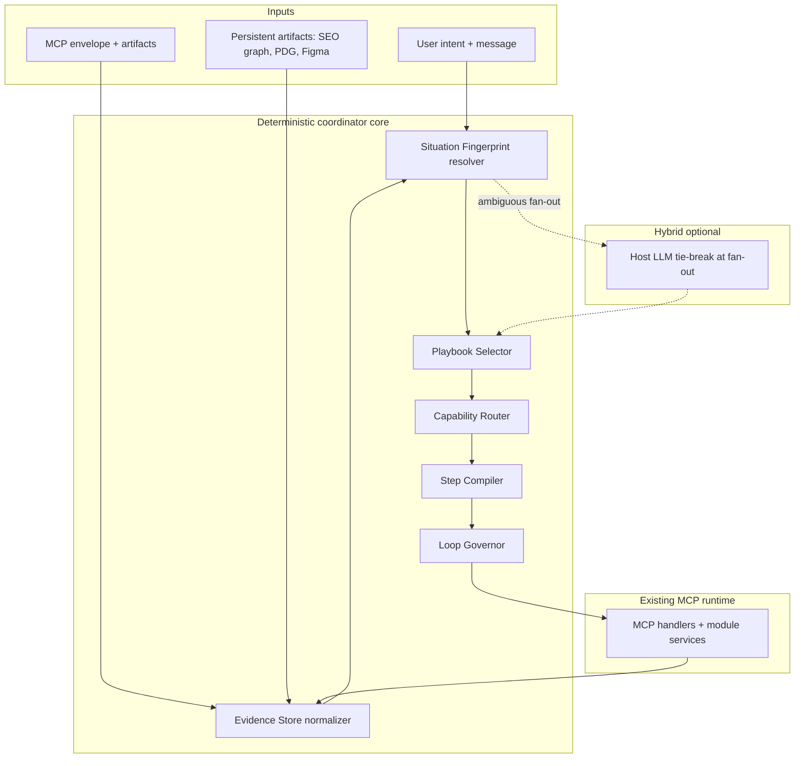
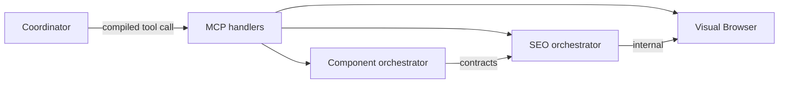
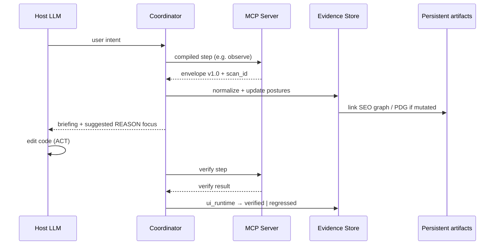
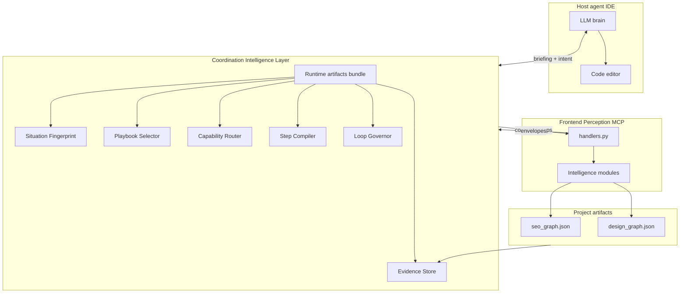
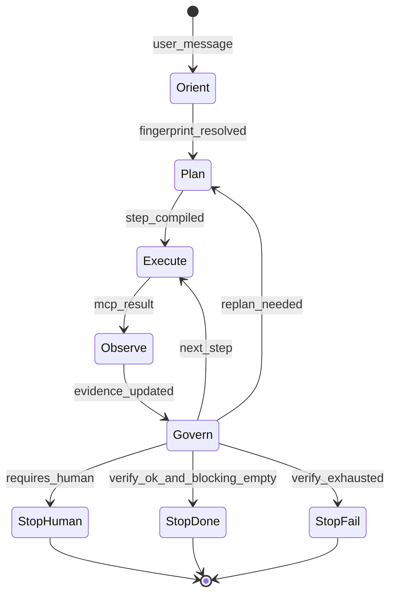

# Report 07 — Coordination Intelligence Architecture

**Status:** Research / design proposal — **not approved for implementation**  
**Date:** 2026-07-12  
**Inputs:** 150-state corpus, 24 clusters, 8 planning patterns, `AGENT_GUIDE.md`, `01_mcp_module_inventory.md`, `05_coordination_design_input.md`, existing SEO/Component orchestration patterns in `src/navigation/`

---

## Executive summary

**Is the proposed 6-layer stack the best architecture for this MCP?**

**Partially.** The loop shape (evidence → plan → execute → evidence update) is correct. The *number* and *naming* of layers should be simplified, and one critical boundary must be enforced: **the host LLM remains the brain for REASON and code ACT** — the Coordination Layer is **intelligence for the brain**, not a replacement brain.

**Recommended direction:** A **hybrid Situation–Capability–Playbook coordinator** with a thin deterministic core and selective LLM assistance at ambiguity points. The 150-state YAML corpus should **not** load at runtime; it should distill into **~5 compact runtime artifacts** plus an **invariant registry**.

**One-line architecture:**

```text
Evidence Store → Situation Fingerprint → Playbook Selector → Capability Router → Step Compiler → Loop Governor
        ↑                                                                              ↓
        └──────────────────── Host LLM (REASON + code ACT) + MCP Execution Engine ───┘
```

---

## 1. Context: what we are coordinating

### 1.1 The MCP is not a generic agent framework

Frontend Perception MCP is deliberately split:

| Layer | Role | Has LLM? |
|-------|------|----------|
| **Host agent** (Cursor, Claude Code, …) | Brain: intent, reasoning, code edits, when to stop | Yes |
| **MCP server** | Deterministic runtime: observe, act in browser, verify, module services | No |
| **Intelligence modules** (14 + AI Visibility) | Domain evidence + some internal orchestration | No |

`AGENT_GUIDE.md` states this explicitly: *"The MCP has no LLM. You are the brain."*

Any Coordination Intelligence design that tries to **automate reasoning or code changes inside MCP** fights the architecture. Coordination should:

- **Compress** what the brain must remember (evidence postures, gates, playbooks).
- **Prevent** illegal or wasteful tool sequences (anti-patterns from Report 01).
- **Suggest** the next semantic step and success criteria — not execute the IDE edit loop.

### 1.2 What already works (patterns to generalize)

Two modules already implement mini-coordinators:

**SEO Intelligence** (`seo_intelligence/planning/`):

- `CAPABILITY_CATALOG` — capability → provider routing with fallbacks
- `SeoAuditPlanner` — builds provider plan from mode + connections
- `SeoAuditOrchestrator` — evidence collection → graph → recommendations → verification plan
- `reasoning_context_v2` — frozen reasoning state artifact

**Component Intelligence** (`component_intelligence/contracts/`):

- Cross-module **protocol contracts** (Framework, Codebase, Design Sense, Consistency, Browser)
- Orchestrated selection and integration with **dry-run default**

The global coordinator should look like **SEO's capability catalog + orchestrator**, lifted to project scope, with **Component's contract pattern** for cross-module eligibility — not like a generic LangGraph agent.

### 1.3 What the state-space research gave us

| Research artifact | Count | Runtime use |
|-------------------|-------|-------------|
| Leaf states | 150 | **No** — design reference only |
| Clusters | 24 | **Yes** — situation fingerprints |
| Planning patterns | 8 | **Yes** — playbook templates |
| Global recovery states | 12 | **Yes** — invariant + recovery registry |
| Module anti-patterns | ~15 | **Yes** — capability gates |
| Evidence domains | 7 | **Yes** — evidence schema |

Report 05 already recommended: start FSM-per-cluster + evidence gates; avoid loading the full graph at runtime.

---

## 2. Research synthesis by topic

### 2.1 Modern planning / orchestration architectures

| Approach | Core idea | Fit for our MCP |
|----------|-----------|-----------------|
| **HTN (Hierarchical Task Network)** | Decompose goals into methods and primitive tasks | **Strong** — maps to clusters → playbooks → semantic actions |
| **BDI (Belief–Desire–Intention)** | Beliefs = evidence, desires = intents, intentions = committed plan | **Strong** — matches evidence postures + user_intents + active playbook |
| **ReAct / observe–think–act** | LLM loop with tool calls | **Partial** — host agent already does this; MCP supplies observe/verify |
| **Plan–Execute–Replan (PEOR)** | Execute until failure, replan from new state | **Strong** — verify failure → replan is our dominant loop |
| **Behavior trees** | Composable control nodes (sequence, selector, parallel) | **Medium** — good for playbook steps, weak for evidence gates |
| **Petri nets / workflow engines** | Durable stateful workflows (Temporal, Inngest) | **Low now** — overkill unless we need multi-day human waits in-server |
| **Blackboard systems** | Shared knowledge board, specialists read/write | **Medium** — evidence store + modules as specialists |

**Conclusion:** HTN + BDI + PEOR, implemented as **deterministic playbooks with evidence preconditions**, best matches our corpus and AGENT_GUIDE. Full classical planning (STRIPS/PDDL) is unnecessary — our "actions" are coarse and module-bounded.

### 2.2 How expert frontend engineers work (natural workflow)

Senior engineers do **not** run a fixed pipeline. They run **episodes** with recurring micro-loops:

1. **Orient** — what's broken / what's the goal? (intent + quick look)
2. **Stabilize runtime** — dev server up, no console explosions (blocking first)
3. **Localize** — which layer: config, code, API, design, infra?
4. **Change minimally** — smallest diff that could work
5. **Verify observably** — repro steps, screenshots, automated checks
6. **Harden** — regression baseline, quality pass before ship
7. **Defer non-blocking work** — SEO, perf polish, design advisory until functional truth

Key behaviors the coordinator must encode:

- **Blocking before advisory** (`agent_summary.blocking` before Design Sense heuristics)
- **Invalid before valid** on forms (AGENT_GUIDE §4)
- **Never loop login** — human gate
- **Prefer cached knowledge** (SEO graph diff, PDG query) over re-collection
- **Interrupt-driven replanning** — user says "forget SEO, fix checkout" mid-episode

### 2.3 State-driven vs prompt-driven planning

| Dimension | State-driven | Prompt-driven |
|-----------|--------------|---------------|
| Stability | High — same evidence → same gates | Low — phrasing drift |
| Debuggability | High — explicit posture + cluster | Low |
| Flexibility on novel tasks | Lower without new states | Higher |
| Fit for deterministic MCP | **Excellent** | Poor for tool gating |

**Recommendation:** **State-driven gates + prompt-driven tie-breaking.**

- Deterministic: module eligibility, evidence thresholds, invariants, retry budgets
- LLM-assisted: intent parsing, cluster disambiguation at fan-out, recommendation prioritization, code edit strategy

Do **not** plan by matching prompts to tools. Plan by matching **(evidence fingerprint, situation class, user intent)** to **playbook templates**, then compile to tools.

### 2.4 Capability-based vs tool-based planning

| Tool-based | Capability-based |
|------------|------------------|
| Plan: `perception_seo_audit` → `perception_verify` | Plan: `collect_seo_evidence` → `derive_recommendations` → `verify_seo_fix` |
| Breaks when tools rename | Stable across MCP versions |
| Encourages tool-first thinking | Encourages project-first thinking |

**Recommendation:** **Capability-based planning** at coordinator level; **tool binding** only in the Step Compiler (thin, versioned table). SEO's `CAPABILITY_CATALOG` is the template.

Capabilities are **not** 1:1 with modules. Examples:

- `rendering_evidence` — Visual Browser (primary), SEO browser provider (consumer)
- `design_system_knowledge` — Consistency PDG (primary), Component contract (consumer)
- `form_behavior_probe` — Design Workflow (primary), Component (secondary)

### 2.5 Continuous replanning and feedback loops

Replan triggers should be **event-based**, not per-step:

| Event | Replan scope |
|-------|--------------|
| `perception_verify` failed | Local: retry ORA loop; maybe switch debug playbook |
| `agent_summary.blocking` non-empty after observe | Insert stabilize-runtime substeps before continuing |
| User message changes intent | Full: new intent stack entry, may preempt current playbook |
| Envelope `degraded[]` | Partial: skip or substitute capability (fallback provider) |
| `auth_gate.requires_human` | **Stop** — no replan until human |
| Evidence posture `regressed` | Insert remediation playbook (debug or quality) |
| Persistent graph diff shows new findings | Extend SEO/consistency playbook |

**Anti-pattern:** Replanning the entire project plan after every successful observe. Most steps advance linearly within a playbook.

### 2.6 Decision making under incomplete evidence

The corpus defines five postures: `unknown → partial → known → verified → regressed`.

Coordinator rules:

1. **Never infer `verified` from `known`** — verification is an explicit event (verify pass or audit clean).
2. **Allow progress on `partial`** when the playbook marks the domain optional for that step.
3. **Block progress on `unknown`** when the playbook lists the domain in `required_evidence`.
4. **Surface `unknown_evidence` explicitly** to the host LLM as questions, not silent assumptions.
5. **Treat `degraded[]` as partial evidence** — proceed with documented uncertainty.

**Information-gathering actions** should be schedulable without a full replan: e.g. if `design_system: unknown` and next step needs PDG, insert `refresh_pdg` before `consistency_audit`.

### 2.7 Multi-stage and long-running orchestration

**Episode** (minutes–hours): one user task — "fix form validation", "run SEO audit". Coordinator scope.

**Project** (days–weeks): maturity M0→M5, multiple episodes. Coordinator holds **persistent artifact pointers** (SEO graph, PDG) across episodes; does not hold full plan across days.

**Long-running human waits** (PR review, OAuth, sign-off): coordinator emits **checkpoint + stop reason**; host agent resumes later. Do not block MCP server process unless we adopt Temporal-like durability (defer).

### 2.8 Knowledge-driven planning

Three knowledge layers:

| Layer | Source | Planner use |
|-------|--------|-------------|
| **Runtime evidence** | MCP envelopes, scans | Immediate gates |
| **Persistent project knowledge** | SEO graph, PDG, Figma context | Diff, query, avoid re-audit |
| **Compiled heuristics** | Distilled from 150-state research | Gates, playbooks, anti-patterns |

The coordinator should **query knowledge before collecting**:

- `seo_query(audit.diff)` before full `seo_audit`
- `design_knowledge_query` before `pdg_refresh`
- `framework_docs` cache before external fetch

---

## 3. Framework landscape (LangGraph, CrewAI, AutoGen, …)

### 3.1 LangGraph

**What it does well:** Explicit graph state, checkpoints, cycles (observe→verify loops), interrupt/resume, parallel branches.

**Where it falls short for us:**

- Assumes the **orchestrator runtime contains the LLM** — we externalize LLM to host agent
- Graph nodes often map to tool calls — we need capability/playbook layer above tools
- State can grow unbounded — we need evidence normalization, not raw message history

**What to borrow:** Checkpoint model for episode state; **conditional edges** as evidence gates; **interrupt** for `requires_human`.

**What to reject:** Making LangGraph the MCP server core — adds framework weight and blurs brain/runtime boundary.

### 3.2 CrewAI / AutoGen (multi-agent)

**What they do well:** Role specialization, delegation, conversation-driven collaboration.

**Where they fall short:**

- **Multi-brain model** — we have one host agent brain + deterministic modules
- Role agents would duplicate module services already in Python
- Hard to enforce AGENT_GUIDE invariants across autonomous agents

**What to borrow:** Nothing at runtime. The *research* agent that built the state space is not the production architecture.

### 3.3 Semantic Kernel / Haystack Agents

Planner + plugin model similar to capability catalog. Useful reference for **plugin gating** and **plan serialization**. Still tool-centric unless adapted.

### 3.4 Temporal / Inngest (durable workflows)

**Borrow if:** we need server-side waits for OAuth, scheduled re-audits, multi-day release pipelines without host agent connected.

**Defer because:** Current model is host-agent-driven sessions; adding durable execution is a major infra commitment. Design coordinator API so a **checkpoint export** could feed Temporal later.

### 3.5 Summary table

| Framework | Borrow | Reject |
|-----------|--------|--------|
| LangGraph | Checkpoints, conditional edges, interrupts | LLM-inside-graph, tool-as-node default |
| CrewAI/AutoGen | — | Multi-agent brains |
| HTN/BDI theory | Hierarchy, beliefs/intentions | Academic planner implementation |
| SEO orchestrator (in-repo) | Capability catalog, orchestrator, reasoning context | SEO-only scope |
| Component contracts (in-repo) | Cross-module protocols | — |

---

## 4. Challenging the proposed architecture

### 4.1 Proposed stack (as stated)

```text
Evidence
  ↓
State Resolver
  ↓
Capability Planner
  ↓
Strategy Planner
  ↓
Execution Planner
  ↓
Execution Engine
  ↓
Evidence Update
  ↓
Repeat
```

### 4.2 What is right

| Element | Verdict |
|---------|---------|
| Evidence-first | **Correct** — matches corpus and SEO pipeline |
| Separate capability planning | **Correct** — generalize SEO catalog pattern |
| Distinct execution | **Correct** — MCP already is execution engine |
| Evidence update loop | **Correct** — PEOR / ORA loop |
| Research → compact artifacts | **Correct** — do not runtime 150 YAMLs |

### 4.3 What should change

| Issue | Problem | Recommendation |
|-------|---------|----------------|
| **State Resolver → 150 states** | Runtime leaf matching is brittle, expensive, false precision | Replace with **Situation Fingerprint** → **cluster** (24), optional leaf *hint* for telemetry only |
| **Strategy + Execution planners** | Overlapping concerns; "strategy" vs "execution" boundary unclear | Merge into **Playbook Runner** + **Step Compiler** |
| **Capability Planner alone** | Modules have internal capabilities (SEO providers, Component contracts) | **Two-tier:** Global Capability Router + **module-internal** planner (delegate) |
| **No Loop Governor** | AGENT_GUIDE invariants need enforcement layer | Add **Loop Governor** (deterministic): retry budget, auth stop, cleanup |
| **No host LLM slot** | Implies MCP plans and reasons end-to-end | Explicit **REASON slot for host LLM** between observe and act |
| **Execution Engine as separate product** | Duplicates existing MCP handlers | **MCP handlers remain execution engine**; coordinator emits *compiled step requests* |

### 4.4 Revised architecture (recommended)



**Layer responsibilities:**

1. **Evidence Store** — Normalize envelopes into `EvidenceRecord` (domains, postures, artifact refs, `degraded[]`, blocking).
2. **Situation Fingerprint** — Compute `(lifecycle_stage_estimate, situation_class, cluster_id, evidence_signature)`; no 150-way classification.
3. **Playbook Selector** — Pick template from 8 patterns + cluster; parameterize (e.g. form vs SEO).
4. **Capability Router** — Given playbook step, which capabilities/modules are legal; apply `modules_must_not_execute`.
5. **Step Compiler** — Map semantic action → MCP tool sequence + arguments schema + success criteria.
6. **Loop Governor** — Enforce invariants, retries, interrupts, ephemeral cleanup.

**Host LLM** sits **between** observe and act for REASON, and **optionally** at fan-out disambiguation — not inside MCP server.

---

## 5. Runtime artifacts (distilled from research)

The 150 states **do not ship**. Generate these at build time from the corpus:

### 5.1 Artifact catalog

| Artifact | Format | Approx size | Source |
|----------|--------|-------------|--------|
| **A1. Cluster Registry** | JSON/YAML | 24 entries | `cluster_index.md` |
| **A2. Capability Graph** | JSON | ~40 nodes, ~80 edges | Report 01 modules + cross-module bridges |
| **A3. Playbook Templates** | YAML | 8 templates | `planning_patterns/` |
| **A4. Decision Heuristics** | YAML rules | ~40 rules | Gates, fan-out, lazy eval from Report 05 |
| **A5. Invariant Registry** | YAML | ~15 hard rules | AGENT_GUIDE + global recovery |
| **A6. Evidence Schema** | JSON Schema | 7 domains × 5 postures | Lifecycle ontology |
| **A7. Tool Binding Table** | YAML (versioned) | ~50 semantic actions | *New compile step* — maps actions → tools |
| **A8. Anti-Pattern Catalog** | YAML | ~15 entries | Report 01 §8 |

**Optional (telemetry / docs, not hot path):**

- **A9. State Lexicon** — index of 150 leaves for debugging ("you are near state X") without runtime matching.

### 5.2 A1 — Cluster Registry (example shape)

```yaml
cluster_id: cluster.feature.form_pipeline
lifecycle_stages: [S05_implementation, S07_verification]
situation_classes: [new_feature, functional_bug]
required_evidence:
  observe: { ui_runtime: partial, codebase: partial }
  verify: { ui_runtime: verified }
default_playbook: invalid_before_valid.form
module_eligibility: [visual_browser, design_workflow_intelligence, frontend_quality, codebase_intelligence]
module_forbidden: [seo_intelligence, figma_intelligence]
mcp_ready_gates: [component_integrate_live]
recovery_cluster: cluster.global.recovery
```

### 5.3 A2 — Capability Graph (concept)

Nodes = **capabilities** (not tools): `rendering_evidence`, `seo_audit`, `pdg_query`, `form_probe`, …

Edges = **requires** | **enhances** | **forbids_if**

Example:

```text
consistency_audit ──requires──► design_system_knowledge (PDG non-empty)
seo_audit ──enhances──► rendering_evidence (scan_id)
component_integrate_live ──forbids_if──► mcp_ready: false
```

### 5.4 A3 — Playbook template (concept)

```yaml
playbook_id: invalid_before_valid.form
steps:
  - semantic_action: probe_form_rules
    capability: form_probe
    evidence_delta: { ui_runtime: partial }
  - semantic_action: run_invalid_submit_check
    capability: browser_verify
    success_criteria: [error_messages_visible]
  - semantic_action: run_valid_submit_check
    capability: browser_verify
    success_criteria: [submit_success, blocking_empty]
retry_budget: 5
on_exhaust: global.verify_loop_exhausted
```

### 5.5 Build pipeline (research → runtime)

```text
coordination_layer/research/   ──build script──►   coordination_layer/runtime/
  state_space/states/*.yaml         (distill)         clusters.json
  planning_patterns/*.md                              playbooks.yaml
  reports/01_*.md                                     capabilities.json
                                                      heuristics.yaml
                                                      invariants.yaml
                                                      tool_bindings.v1.yaml
```

Human-readable research stays; runtime dir is **small, diffable, reviewable**.

---

## 6. How the coordinator should reason

### 6.1 Reasoning split (deterministic vs AI)

| Concern | Owner | Mechanism |
|---------|-------|-----------|
| Parse user intent | **Host LLM** | Natural language → `situation_class` + goals |
| Normalize MCP results | **Deterministic** | Envelope parser → evidence postures |
| Classify situation | **Deterministic first** | Rule match on evidence + intent → cluster |
| Disambiguate fan-out | **Host LLM optional** | When 2+ playbooks score equally |
| Choose fix strategy | **Host LLM** | Code edits, hypothesis — REASON phase |
| Select MCP tools | **Deterministic** | Step Compiler from semantic action |
| Enforce safety | **Deterministic** | Loop Governor |
| Prioritize SEO/consistency recs | **Host LLM** | Rank by impact; MCP supplies list |
| When to stop | **Deterministic + LLM** | Verify pass + blocking empty; LLM for "good enough?" |

**Golden rule:** If a wrong decision can **call the wrong MCP tool** or **skip verify**, it must be **deterministic**. If it requires **judgment**, it stays with the **host LLM**.

### 6.2 Coordinator output (what the brain receives)

Not raw plans — **structured briefing**:

```yaml
episode_id: ep_20260712_001
situation:
  cluster_id: cluster.feature.form_pipeline
  lifecycle_stage: S07_verification
  evidence_posture: { ui_runtime: partial, codebase: known, ... }
active_playbook: invalid_before_valid.form
current_step: run_invalid_submit_check
compiled_mcp_step:
  tools: [perception_probe_form, perception_execute_actions, perception_verify]
  criteria: { text_contains: ["Required field"] }
gates:
  blocked: []
  degraded: []
invariants_active: [verify_before_done, invalid_before_valid]
suggested_next_after_success: run_valid_submit_check
stop_conditions: [auth_gate.requires_human, verify_loop_exhausted]
```

The host LLM uses this as **program state**, not as a suggestion to ignore.

### 6.3 Module communication model

**Do not** build a new message bus between modules. Use existing patterns:

| Pattern | When | Example |
|---------|------|---------|
| **Shared artifact refs** | Pass `scan_id`, `snapshot_id`, `audit_id` | SEO audit consumes scan |
| **Contract consultation** | Module needs peer signal | Component selection |
| **Graph/query APIs** | Persistent knowledge | `seo_query`, `design_knowledge_query` |
| **Coordinator gate only** | Before first call | `modules_must_not_execute` |

Coordinator talks to **MCP tools** (execution boundary), not to module internals. Module orchestrators (SEO, Component) remain authoritative inside their domain.



---

## 7. Evidence flow

### 7.1 Evidence lifecycle



### 7.2 Evidence record schema (runtime)

```yaml
episode_id: string
domains:
  ui_runtime: { posture: verified, scan_id: scan_abc, updated_at: ... }
  codebase: { posture: partial, repo_root: ..., framework: nextjs }
  design_source: { posture: unknown }
  design_system: { posture: partial, pdg_path: .perception/design_graph.json }
  seo: { posture: known, audit_id: audit_xyz, graph_path: .cache/seo_graph.json }
  quality: { posture: partial, last_audit: ... }
  assets: { posture: unknown }
blocking: []
degraded: []
active_playbook: ...
retry_counters: { verify_loop: 2 }
```

### 7.3 Posture transition rules (deterministic)

| Event | Transition |
|-------|--------------|
| First observe | `unknown` → `partial` |
| Rich observe + no blocking | `partial` → `known` |
| verify ok | `known` → `verified` |
| verify fail / new blocking | `*` → `regressed` |
| Successful fix + verify | `regressed` → `verified` |
| Staleness TTL exceeded | `verified` → `partial` (optional v2) |

---

## 8. Continuous replanning

### 8.1 Replanning modes

| Mode | Trigger | Behavior |
|------|---------|----------|
| **Step advance** | Step success | Next step in playbook (no replan) |
| **Local repair** | Verify fail, retries remain | Same playbook, same step, ORA loop |
| **Playbook switch** | Signal class change | e.g. debug playbook replaces feature playbook |
| **Episode replan** | User intent change | New cluster + playbook; push prior on stack |
| **Full stop** | `requires_human`, `user_abandoned` | Checkpoint export; no auto replan |

### 8.2 Intent stack (for interruptions)

```text
Stack bottom: ship landing page (cluster.feature.data_ui)
Stack top:    fix console error (cluster.debug.signal_class)  ← current
```

When top completes, pop to bottom. Prevents thrashing without losing original goal.

### 8.3 Replanning pseudocode (deterministic core)

```text
on_mcp_result(envelope):
  evidence.update(envelope)
  if governor.violated(invariants): return STOP(reason)
  if envelope.verify_failed and retries < budget: return RETRY_SAME_STEP
  if envelope.verify_failed: return SWITCH_PLAYBOOK(debug)
  if evidence.regressed(domain): return INSERT_STEP(gather_evidence)
  if playbook.has_next_step: return ADVANCE
  if intent_stack.depth > 1: return POP_INTENT
  return EPISODE_COMPLETE
```

---

## 9. Bottlenecks and scalability

| Risk | Severity | Mitigation |
|------|----------|------------|
| **150-state runtime matching** | High if implemented | **Do not implement** — use 24 clusters |
| **Over-planning latency** | Medium | Cache fingerprint per scan; plan one step ahead only |
| **Tool binding drift** | Medium | Version tool_bindings; contract tests (already have T1) |
| **Evidence store bloat** | Medium | Episode-scoped; summarize for host LLM |
| **Duplicate orchestration** | Medium | Coordinator defers to SEO/Component internal planners |
| **LLM ignoring coordinator** | High | Briefing format + invariants in AGENT_GUIDE update |
| **Multi-session continuity** | Medium | Persist artifact pointers only; reload postures on episode start |
| **Human wait durability** | Low now | Checkpoint export; Temporal later if needed |
| **mcp_ready: false paths** | Medium | Capability graph `forbids_if` — hard block live install |
| **Parallel module calls** | Low | Step Compiler marks parallelizable steps explicitly |

---

## 10. What to simplify

1. **Collapse 6 planner layers → 4:** Evidence Store, Playbook Selector (+ Capability Router inside), Step Compiler, Loop Governor.
2. **Drop "State Resolver" name** — use Situation Fingerprint → cluster (24).
3. **Do not duplicate AGENT_GUIDE** — invariants live in one registry; AGENT_GUIDE references coordinator briefing fields.
4. **One playbook active at a time** — nested sub-playbooks only for debug interrupt.
5. **Defer LangGraph** until checkpoint/resume proves necessary.
6. **No coordinator-side code editing** — ever.
7. **Telemetry optional** — leaf state *hints* for analytics, not control flow.
8. **Build-time distillation** — runtime artifacts < 500KB total.

---

## 11. Trade-off matrix (architecture options)

| Option | Pros | Cons | Verdict |
|--------|------|------|---------|
| **A. Full 150-state FSM runtime** | Maximum fidelity | Brittle, heavy, false precision | **Reject** |
| **B. Proposed 6-layer stack unchanged** | Clear separation | Over-layered; blurs LLM boundary | **Revise** |
| **C. Recommended hybrid (§4.4)** | Matches MCP + corpus + SEO pattern | Requires build pipeline for artifacts | **Adopt** |
| **D. LangGraph-native MCP** | Checkpoints, interrupts | Wrong LLM placement; framework lock-in | **Defer borrowings only** |
| **E. Prompt-only coordinator** | Flexible | Ungovernable tool gating | **Reject** |
| **F. Module-only orchestration (no global)** | Simple | No cross-domain episodes (form→SEO→release) | **Reject** |

---

## 12. Proposed final architecture

### 12.1 Name

**Perception Coordination Intelligence (PCI)** — or **Coordination Intelligence Layer (CIL)**. Distinct from "agent framework"; sits beside MCP as advisory + gating layer consumed by host agent (and optionally exposed as MCP **resources**, not tools).

### 12.2 Component diagram



### 12.3 Episode state machine (outer)



### 12.4 What remains from your proposal

| Your component | Final form |
|----------------|------------|
| Evidence | **Evidence Store** (+ persistent artifact loaders) |
| State Resolver | **Situation Fingerprint** → cluster (not 150 leaves) |
| Capability Planner | **Capability Router** (+ module-internal planners) |
| Strategy Planner | **Playbook Selector** |
| Execution Planner | **Step Compiler** |
| Execution Engine | **Existing MCP handlers** (unchanged) |
| Evidence Update | **Evidence Store** normalize pass |
| Repeat | **Loop Governor** + PEOR |

### 12.5 What changes

- Fewer layers; clearer LLM boundary
- Runtime artifacts instead of research YAML
- Coordinator as **briefing service** to host agent, not autonomous agent
- Explicit **Intent Stack** for interrupts
- **Two-tier capability planning** (global + module-internal)

### 12.6 Implementation phases (for future approval — not now)

| Phase | Deliverable | Depends on |
|-------|-------------|------------|
| P0 | Build distillation script → runtime artifacts | This report approved |
| P1 | Evidence Store + schema | P0 |
| P2 | Situation Fingerprint + 24 clusters | P1 |
| P3 | Playbook Runner (8 templates) + Loop Governor | P2 |
| P4 | Step Compiler + tool_bindings.v1 | P3 |
| P5 | MCP resource `perception://coordination/briefing` (read-only) | P4 |
| P6 | Fan-out LLM disambiguation (optional) | P5 |

**No phase writes autonomous MCP tools that replace host reasoning.**

---

## 13. Answers to explicit design questions

| Question | Answer |
|----------|--------|
| **Is this the best architecture for our MCP?** | **Hybrid Situation–Capability–Playbook coordinator** (§4.4, §12) — not the 6-layer stack as named, not a generic agent framework. |
| **What should change?** | State Resolver → fingerprint; merge Strategy+Execution planners; add Loop Governor; explicit host LLM REASON slot; MCP handlers stay execution engine. |
| **What should remain?** | Evidence-first loop; capability-based planning; research distillation; SEO/Component orchestration patterns; AGENT_GUIDE invariants. |
| **What runtime artifacts?** | A1–A8 in §5.1; optional A9 lexicon for telemetry. |
| **How should coordinator reason?** | Deterministic gates + playbooks; LLM for intent, fixes, tie-breaks; briefing to host (§6). |
| **Deterministic vs AI?** | Table in §6.1 — tool selection and safety deterministic; judgment LLM. |
| **Module communication?** | Artifact refs + contracts; coordinator via MCP tools only (§6.3). |
| **Evidence flow?** | §7 — normalize envelopes → postures → persistent links. |
| **Continuous replanning?** | Event-based PEOR + intent stack (§8). |
| **Bottlenecks / scalability?** | §9 — chief risk is over-engineering state runtime. |
| **What can we simplify?** | §10 — 4 components, 24 clusters, 8 playbooks, no LangGraph core. |

---

## 14. Recommendation for approval gate

Before implementation, confirm:

1. **Coordinator is advisory to host LLM** — not a second brain inside MCP.
2. **150 states stay research-only** — runtime uses distilled artifacts (§5).
3. **Adopt revised 4-component core** — Evidence Store, Playbook Selector (+ Capability Router), Step Compiler, Loop Governor.
4. **Defer LangGraph integration** — borrow checkpoint/interrupt concepts only.
5. **First playbook to implement end-to-end:** `invalid_before_valid.form` (AGENT_GUIDE §4, existing eval coverage).
6. **First capability graph slice:** Visual Browser + Design Workflow + Frontend Quality (ORA loop).

---

## 15. Related documents

| Document | Role |
|----------|------|
| `coordination_layer/research/reports/05_coordination_design_input.md` | State-graph statistics feeding this report |
| `coordination_layer/research/reports/01_mcp_module_inventory.md` | Capability + anti-pattern source |
| `coordination_layer/research/planning_patterns/` | Playbook template source |
| `coordination_layer/research/state_space/abstracted/cluster_index.md` | Cluster registry source |
| `AGENT_GUIDE.md` | Invariant source for Loop Governor |
| `src/navigation/seo_intelligence/planning/` | Reference orchestrator implementation |

---

*End of Report 07. Awaiting review before any implementation.*
