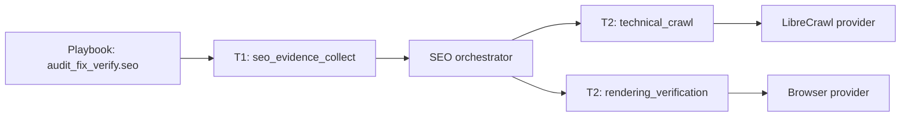

# Report 08 — Runtime Artifacts & Capability Graph

**Status:** **FROZEN** — approved 2026-07-12; P0 implementation in progress  
**Date:** 2026-07-12  
**Supersedes naming in:** Report 07 (`Situation Fingerprint` → **Project Situation Model**)  
**Locked decisions (from review):**

1. 150-state corpus = **research only**, never runtime control flow.  
2. Host LLM = **only reasoning engine**. Coordination Intelligence = deterministic, advisory (orchestrate, gate, compile, verify).  
3. Runtime center of gravity = **Capability Graph** as stable contract between coordinator and all intelligence modules.

---

## Executive summary

This report defines the **eight runtime artifacts** distilled from research, with the **Capability Graph** specified as a first-class contract system—not a loose module list.

**Naming decision:** Adopt **Project Situation Model (PSM)** as the runtime object representing current project condition. Retire "Situation Fingerprint" as a top-level name; keep `cluster_signature` as a **derived field inside PSM** used for playbook routing.

**Capability definition:** A **capability** is a versioned, contract-bound unit of observable work that **produces and/or consumes evidence** under explicit preconditions. Capabilities are **not** MCP tools and **not** modules. One module implements many capabilities; one capability may route to multiple modules with priority/fallback.

**Architecture freeze after this report:** P0 may implement artifact schemas + distillation build only.

---

## 1. Project Situation Model (PSM)

### 1.1 Why PSM, not "Situation Fingerprint"

| Term | Implied meaning | Problem |
|------|-----------------|---------|
| **Situation Fingerprint** | A hash or classifier output | Sounds like a **label**, not a living model. Under-represents evidence, constraints, confidence, and episode context. |
| **Project Situation Model** | Current structured belief about the project | Matches user intent: state + evidence + constraints + confidence. |

**Resolution:** Use **Project Situation Model (PSM)** for the runtime document. Inside PSM, include:

- `cluster_signature` — deterministic hash of `(situation_class, lifecycle_stage, evidence_posture_vector, active_constraints, available_capabilities)` for routing
- `cluster_id` — matched playbook cluster (24 registry entries)
- `leaf_hint` — optional telemetry string referencing research lexicon ("near `saas.S07.form_validation.v1`"); **never used for control flow**

### 1.2 PSM schema (runtime artifact **R1**)

```yaml
# coordination_layer/runtime/schemas/project_situation_model.v1.json
schema_version: "1.0"
episode_id: string          # ep_{uuid}
project_id: string          # hash(repo_root) or user-supplied
updated_at: ISO8601

# --- Classification (derived, deterministic) ---
situation:
  situation_class: string   # from ontology Axis E
  lifecycle_stage: string   # S01_intent .. S12_evolution
  project_maturity: string  # M0 .. M6
  cluster_id: string        # cluster.* from registry
  cluster_signature: string # sha256 canonical subset — for cache/dedup
  leaf_hint: string | null  # telemetry/debug only — NEVER planning or routing
  capability_posture:       # included in cluster_signature hash
    eligible: string[]      # T1 capability IDs currently invokable
    blocked: string[]       # gated by constraints or evidence
    deferred: string[]      # intentionally postponed (e.g. SEO until S08)

# --- Evidence (authoritative) ---
evidence:
  domains:
    ui_runtime: EvidenceDomainState
    codebase: EvidenceDomainState
    design_source: EvidenceDomainState
    design_system: EvidenceDomainState
    seo: EvidenceDomainState
    quality: EvidenceDomainState
    assets: EvidenceDomainState
  blocking: string[]       # from agent_summary.blocking
  degraded: string[]         # accumulated envelope degraded notes
  unknown_gaps: string[]     # explicit gaps blocking next step

# --- Constraints (hard gates) ---
constraints:
  mcp_ready_blocks: string[]     # e.g. component_integrate_live
  modules_forbidden: string[]      # anti-pattern catalog
  invariants_active: string[]      # from invariant registry
  human_gates: string[]          # e.g. auth_gate_pending

# --- Episode control ---
episode:
  active_playbook_id: string | null
  active_step_id: string | null
  intent_stack: IntentFrame[]    # bottom = original goal, top = current
  retry_counters:
    verify_loop: int
    capability_attempts: { [capability_id]: int }
  confidence: episode_confidence  # high | medium | low

# --- Artifact pointers (not full payloads) ---
artifacts:
  session_id: string | null
  scan_id: string | null
  snapshot_id: string | null
  audit_id: string | null
  repo_root: string | null
  website_url: string | null
  persistent:
    seo_graph_path: string | null
    pdg_path: string | null
    figma_connected: boolean

# --- Compiler output (advisory briefing) ---
briefing:
  suggested_next_capability: string | null
  suggested_semantic_action: string | null
  compiled_step_preview: object | null
  stop_reason: string | null
```

```yaml
# EvidenceDomainState (embedded)
posture: unknown | partial | known | verified | regressed
updated_at: ISO8601 | null
source_capability: string | null   # which capability last updated this domain
artifact_refs: { [key]: string }    # e.g. scan_id, audit_id
staleness_ttl_seconds: int | null
```

### 1.3 PSM update rules (deterministic)

| Event | PSM mutation |
|-------|--------------|
| MCP envelope received | Update `evidence.domains.*`, `blocking`, `degraded`; refresh artifact refs |
| Posture transition | Apply lattice rules (see §7) |
| Playbook step advance | Update `episode.active_step_id` |
| Capability invocation | Increment `retry_counters.capability_attempts` |
| User intent message | Push `IntentFrame` on stack; may change `situation.*` |
| Invariant violation | Set `briefing.stop_reason`; add `constraints.human_gates` if needed |
| Episode end | Export checkpoint; clear session-scoped fields |

**PSM is the single source of truth** the coordinator reads/writes. Host LLM receives `briefing` + selected PSM fields—not the full 150-state graph.

**P1 naming:** The live in-memory implementation is **PSM Runtime** (`coordination_intelligence.psm.runtime`). It owns evidence, postures, constraints, sessions, auth/verification state, playbook progress, and execution context. Router, Selector, Compiler, and Governor operate **only on PSM Runtime**, never on raw MCP envelopes.

---

## 2. What is a capability?

### 2.1 Definition

> **Capability** — A stable, versioned identifier for a **bounded unit of observable work** that the MCP ecosystem can perform, characterized by:
> - evidence it **requires** (preconditions),
> - evidence it **produces** (postconditions),
> - **implementation routing** to one or more modules,
> - **degradation** behavior when prerequisites fail,
> - and **coordination metadata** (parallelism, cost, risk).

Capabilities sit **between** playbooks and MCP tools:

```text
Playbook step (semantic_action)
        ↓
Global capability (e.g. browser_verify)
        ↓
Module router (e.g. visual_browser_intelligence)
        ↓
MCP tool(s) (e.g. perception_verify)
```

### 2.2 What a capability is NOT

| Not a capability | Why | Correct layer |
|------------------|-----|---------------|
| `perception_verify` | Tool name; may change per version | Tool Binding Table |
| `visual_browser_intelligence` | Module; implements many capabilities | Module registry |
| `technical_crawl` (SEO-internal) | Sub-capability inside SEO module | Module-internal catalog (delegated) |
| "Fix the login bug" | Requires reasoning | Host LLM |
| Entire `seo_audit` orchestration | Composite workflow | Playbook + multiple capabilities |

### 2.3 Two-tier capability model

| Tier | Owner | Scope | Example |
|------|-------|-------|---------|
| **T1 — Global** | Coordination Intelligence | Cross-module; playbook-visible | `browser_observe`, `seo_evidence_collect` |
| **T2 — Module-internal** | Module orchestrator | Provider routing inside module | SEO `technical_crawl` → librecrawl/browser |

**Rule:** Playbooks reference **T1 only**. When a T1 capability routes to a module with an internal orchestrator (SEO, Component), that module runs its **T2 plan** without coordinator micromanagement.



### 2.5 Design principle — capabilities, not modules

> **Coordination Intelligence is designed around capabilities, not modules.** Modules are implementations; capabilities are contracts. Future intelligence modules integrate by registering Capability Contracts in R2 — the coordinator remains module-agnostic.

**T1 compaction rule:** Capabilities represent **engineering intent**, not individual MCP tool operations. If a capability maps 1:1 to a single tool, it likely belongs in T2 (module-internal). Keep T1 compact and stable; tool evolution flows through R8 bindings only.

### 2.6 Capability ID naming convention

```text
{domain}_{verb}_{object?}
```

Examples: `browser_observe`, `browser_verify`, `codebase_route_lookup`, `seo_graph_query`, `consistency_pdg_refresh`, `form_probe`, `resource_icon_match`.

- Lowercase snake_case, stable across MCP versions  
- Never prefix with `perception_`  
- Module-internal IDs may use namespace: `seo.technical_crawl` (T2 only)

---

## 3. Capability contract (full specification)

Each node in the Capability Graph is a **CapabilityContract** (runtime artifact **R2** node).

### 3.1 Contract fields

```yaml
capability_id: browser_verify
schema_version: "1.0"
display_name: "Verify UI against success criteria"
tier: T1_global
kind: verify                    # observe | collect | transform | query | verify | probe | mutate | session

# --- Evidence contract ---
requires:
  evidence:
    ui_runtime: { min_posture: partial }
  artifacts:
    - session_id
  optional_artifacts:
    - scan_id_before          # for diff-capable verify
  environment:
    - dev_server_reachable    # unless url is production

produces:
  evidence:
    ui_runtime: { posture: verified | regressed }
  artifacts:
  may_set:
    - scan_id                 # on failure auto-observe

# --- Routing ---
implements:
  - module_id: visual_browser_intelligence
    priority: 1
    tools: [perception_verify]           # compiled by Step Compiler
    tool_arg_map: capability_tool_binding_ref
  - module_id: design_workflow_intelligence
    priority: 2                          # only when criteria are flow-based
    condition: playbook_requires_flow_checkpoint

# --- Behavior ---
degradation:
  on_missing_session: hard_fail          # hard_fail | skip | substitute
  on_missing_scan: auto_observe_first
  on_tool_error: propagate_to_governor
  degraded_posture: partial              # never upgrade to verified if degraded

parallel:
  parallelizable: false                  # verify must be sequential after act
  parallel_group: null
  mutex_with: [browser_observe]          # cannot run simultaneously same session

cost:
  relative_weight: 2                     # 1=cheap, 5=expensive
  typical_latency_ms: 3000
  external_dependencies: []

risk:
  mutates_repo: false
  mutates_remote: false
  requires_human: false
  mcp_ready: true
  blast_radius: low                      # low | medium | high

# --- Replanning ---
replan_triggers:
  on_posture_regressed: [switch_playbook_debug]
  on_verify_fail: [retry_same_step, increment_verify_counter]
  on_hard_fail: [emit_stop_reason]

# --- Module extension ---
module_internal:
  delegates_to_orchestrator: false
  t2_capability_namespace: null
```

### 3.2 Contract invariants

1. **`requires` must be checkable from PSM alone** before invocation (deterministic gate).
2. **`produces` must be derivable from envelope parsing** after invocation (no LLM inference).
3. **`implements` must list at least one module** with `mcp_ready: true` OR capability marked `mcp_ready: false` with `risk.blast_radius` documented.
4. **Verify capabilities** must never set `verified` if `degraded[]` non-empty unless playbook explicitly allows `verified_with_degradation`.
5. **T2 capabilities** must not appear in playbook templates directly.

### 3.3 Preconditions vs postconditions (formal)

| Type | Checked when | Failure mode |
|------|--------------|--------------|
| **Precondition (evidence)** | Before compile | `gate_blocked` — coordinator does not call MCP |
| **Precondition (artifact)** | Before compile | `gather_first` — insert capability step |
| **Precondition (environment)** | Before compile | `stop` or `human_gate` |
| **Postcondition (evidence)** | After envelope normalize | Update PSM postures |
| **Postcondition (artifact)** | After envelope normalize | Update `artifacts.*` |
| **Invariant** | Continuous | Loop Governor |

---

## 4. Capability Graph structure

Runtime artifact **R2**: `capability_graph.v1.yaml`

### 4.1 Graph elements

**Nodes:** `CapabilityContract` (§3)

**Edges:** typed relations between capabilities (not modules):

| Edge type | Meaning | Example |
|-----------|---------|---------|
| `requires` | A must complete before B (evidence) | `design_snapshot_build` → requires → `browser_observe` |
| `enhances` | A improves quality of B but optional | `browser_observe` → enhances → `seo_evidence_collect` |
| `conflicts` | Must not run concurrently | `audit_mode_enable` ↔ `debug_mode_enable` |
| `supersedes` | Prefer A over B when both eligible | `seo_graph_diff_query` → supersedes → `seo_full_audit` |
| `fallback` | If A fails/degrades, try B | `lighthouse_perf_audit` → fallback → `browser_observe` |
| `mutex` | Same as conflicts (session-scoped) | `browser_observe` mutex `browser_verify` during act |

```yaml
edges:
  - from: browser_observe
    to: design_snapshot_build
    type: requires
    notes: snapshot needs scan_id

  - from: seo_graph_diff_query
    to: seo_full_audit
    type: supersedes
    condition: seo_graph_exists_and_fresh

  - from: component_integrate_live
    to: component_integrate_dry_run
    type: supersedes
    condition: always_when_mcp_ready_false

  - from: consistency_audit
    to: consistency_pdg_refresh
    type: requires
    condition: pdg_empty
```

### 4.2 Capability → Module mapping

Separate index for fast routing (denormalized from contracts):

```yaml
# capability_module_index (part of R2)
modules:
  visual_browser_intelligence:
    capabilities: [browser_health, browser_observe, browser_verify, browser_diff, browser_execute]
  seo_intelligence:
    capabilities: [seo_evidence_collect, seo_graph_query, seo_recommendation_verify, seo_connect]
    orchestrator_entry: seo_evidence_collect   # triggers T2 plan
  component_intelligence:
    capabilities: [component_search_plan, component_search, component_select, component_integrate_dry_run]
    orchestrator_entry: component_integrate_dry_run
```

**Future modules** add rows here + contract nodes—coordinator code unchanged if contracts are complete.

### 4.3 Capability → Evidence mapping

```yaml
# evidence_capability_matrix (part of R2)
domains:
  ui_runtime:
    primary_producers: [browser_observe, browser_verify, browser_diff]
    consumers: [browser_verify, design_snapshot_build, form_probe, seo_evidence_collect]
  design_system:
    primary_producers: [consistency_pdg_refresh, figma_context_load]
    consumers: [consistency_audit, consistency_assess, component_select]
  seo:
    primary_producers: [seo_evidence_collect, seo_graph_query]
    consumers: [seo_recommendation_verify, playbook_seo_fix_loop]
```

This matrix drives **PSM posture updates** after each capability completes.

### 4.4 Parallelizable capabilities

```yaml
parallel_groups:
  bootstrap_probe:
    parallelizable: true
    capabilities: [environment_health, framework_detect, codebase_stats]
    join_policy: all_complete_before_next_step
    shared_artifacts: [repo_root]

  component_selection_consult:
    parallelizable: true
    capabilities: [framework_component_eval, codebase_component_eval, design_sense_component_eval, consistency_component_eval]
    join_policy: all_complete_before_select
    note: Component module runs this internally; global coordinator marks group for telemetry

  quality_triad:
    parallelizable: true
    capabilities: [lighthouse_a11y_audit, lighthouse_perf_audit, lighthouse_best_practices_audit]
    join_policy: all_complete_before_advance
    mutex_with: [browser_verify]   # audits need stable page
```

**Coordinator rule:** Only capabilities in the same `parallel_group` with `parallelizable: true` may be compiled into concurrent MCP calls. Default is **sequential**.

### 4.5 Replanning triggers (capability-attached)

Global replan registry (runtime artifact **R6**) + per-capability `replan_triggers`.

| Trigger ID | Detected when | Replan action |
|------------|---------------|---------------|
| `TR_VERIFY_FAIL` | verify capability → posture regressed | retry if budget; else debug playbook |
| `TR_BLOCKING_NONEMPTY` | observe → blocking.length > 0 | insert stabilize_runtime before quality/design |
| `TR_DEGRADED_UPSTREAM` | degraded contains provider_unavailable | fallback edge or skip optional capability |
| `TR_AUTH_REQUIRED` | auth_gate requires_human | STOP — set human_gate |
| `TR_EVIDENCE_GAP` | required min_posture not met | insert gather capability (graph requires edge) |
| `TR_INTENT_CHANGE` | new user intent frame | push stack; re-resolve cluster |
| `TR_INVARIANT_VIOLATION` | governor rule fired | STOP with reason |
| `TR_VERIFY_EXHAUSTED` | retry_counters.verify_loop >= budget | STOP; suggest full_diagnosis |
| `TR_MCP_NOT_READY` | capability mcp_ready false | route to fallback or block with message |

Capabilities attach local triggers; governor merges with global registry.

---

## 5. Global capability catalog (T1 initial set)

Distilled from module inventory + 24 clusters. **~45 T1 capabilities** for v1 (implement subset in P0–P4).

### 5.1 Environment & session

| ID | Module(s) | Produces |
|----|-----------|----------|
| `environment_health` | visual_browser | partial ui_runtime |
| `session_start` | visual_browser | session_id |
| `session_end` | visual_browser | — |
| `framework_detect` | framework_intelligence | codebase partial |
| `framework_docs_fetch` | framework_intelligence | codebase known |

### 5.2 Browser observe / act / verify

| ID | Module(s) | Produces |
|----|-----------|----------|
| `browser_observe` | visual_browser | ui_runtime known |
| `browser_navigate_observe` | visual_browser | ui_runtime known + scan |
| `browser_verify` | visual_browser | ui_runtime verified/regressed |
| `browser_diff` | visual_browser | quality partial |
| `browser_execute` | visual_browser | ui_runtime partial |

### 5.3 Codebase

| ID | Module(s) | Produces |
|----|-----------|----------|
| `codebase_context` | codebase_intelligence | codebase known |
| `codebase_route_lookup` | codebase_intelligence | codebase partial |

### 5.4 Design workflow

| ID | Module(s) | Produces |
|----|-----------|----------|
| `form_probe` | design_workflow | ui_runtime partial |
| `route_guards_probe` | design_workflow | ui_runtime partial |
| `auth_gate` | design_workflow | human_gates |
| `flow_describe` | design_workflow | — |
| `state_save` / `state_restore` | design_workflow | session artifacts |

### 5.5 Design pipeline

| ID | Module(s) | Produces |
|----|-----------|----------|
| `design_snapshot_build` | design_snapshot_engine | snapshot_id, design_system partial |
| `design_review` | design_sense | design_source partial (advisory) |
| `consistency_pdg_refresh` | consistency | design_system known |
| `consistency_pdg_query` | consistency | design_system known |
| `consistency_audit` | consistency | design_system verified/regressed |
| `consistency_propose_fix` | consistency | — (advisory diff) |

### 5.6 Quality (Lighthouse path)

| ID | Module(s) | Produces |
|----|-----------|----------|
| `lighthouse_a11y_audit` | frontend_quality | quality known |
| `lighthouse_perf_audit` | frontend_quality | quality known |
| `lighthouse_best_practices_audit` | frontend_quality | quality known |
| `lighthouse_seo_audit` | frontend_quality | seo partial (distinct from SEO intel) |
| `console_capture` | frontend_quality | quality partial |
| `network_capture` | frontend_quality | quality partial |
| `full_diagnosis` | frontend_quality | quality known |

### 5.7 SEO & AI visibility (T1 composite)

| ID | Module(s) | Produces |
|----|-----------|----------|
| `seo_status` | seo_intelligence | seo partial |
| `seo_connect` | seo_intelligence | constraints update |
| `seo_evidence_collect` | seo_intelligence (orchestrator) | seo known |
| `seo_graph_query` | seo_intelligence | seo known |
| `seo_recommendation_verify` | seo_intelligence | seo verified/regressed |
| `ai_visibility_derive` | seo_intelligence (T2 via adapter) | seo known (ai_signals) |

### 5.8 Creative & assets

| ID | Module(s) | Produces |
|----|-----------|----------|
| `inspiration_discover` | inspiration | design_source partial |
| `inspiration_collect` | inspiration | assets partial |
| `inspiration_session_end` | inspiration | cleanup |
| `resource_search` | resource | assets partial |
| `resource_observe_bridge` | resource + visual_browser | assets known |
| `resource_license_check` | resource | assets known |
| `figma_connect` | figma | design_source |
| `figma_context_load` | figma | design_source known |

### 5.9 Component

| ID | Module(s) | Produces |
|----|-----------|----------|
| `component_search_plan` | component | — |
| `component_search` | component | assets partial |
| `component_select` | component (multi-contract) | — |
| `component_integrate_dry_run` | component | codebase known |
| `component_integrate_live` | component | **mcp_ready: false** |

---

## 6. Runtime artifact catalog (frozen set)

All artifacts live under `coordination_layer/runtime/` after P0 build. Research stays in `coordination_layer/research/`.

| ID | File | Format | Purpose |
|----|------|--------|---------|
| **R0** | `manifest.json` | JSON | Versions, checksums, build provenance |
| **R1** | `project_situation_model.schema.json` | JSON Schema | PSM validation |
| **R2** | `capability_graph.v1.yaml` | YAML | Contracts + edges + indexes |
| **R3** | `cluster_registry.v1.yaml` | YAML | 24 clusters → playbooks, gates |
| **R4** | `playbook_templates.v1.yaml` | YAML | 8 playbooks |
| **R5** | `invariant_registry.v1.yaml` | YAML | Hard rules |
| **R6** | `replan_registry.v1.yaml` | YAML | Global triggers |
| **R7** | `decision_heuristics.v1.yaml` | YAML | Fan-out, lazy eval rules |
| **R8** | `tool_bindings.v1.yaml` | YAML | semantic_action → tools |
| **R9** | `anti_patterns.v1.yaml` | YAML | modules_must_not_execute |
| **R10** | `evidence_lattice.v1.yaml` | YAML | Posture transition rules |
| **R11** | `state_lexicon.v1.json` | JSON | Optional telemetry map research→hint |

### 6.1 R0 manifest

```json
{
  "bundle_version": "1.0.0",
  "generated_at": "ISO8601",
  "source_git_sha": "...",
  "research_state_count": 150,
  "artifacts": {
    "capability_graph": { "path": "capability_graph.v1.yaml", "sha256": "..." },
    "cluster_registry": { "path": "cluster_registry.v1.yaml", "sha256": "..." }
  },
  "capability_counts": { "T1": 45, "edges": 72, "mcp_ready_false": 3 }
}
```

### 6.2 R3 cluster_registry (shape)

```yaml
clusters:
  - cluster_id: cluster.feature.form_pipeline
    default_playbook: invalid_before_valid.form
    situation_classes: [new_feature, functional_bug]
    lifecycle_stages: [S05_implementation, S07_verification]
    required_capabilities_sequence: [form_probe, browser_execute, browser_verify]
    evidence_gates:
      seo_evidence_collect: { min_posture: known, defer_until: S08_quality }
    modules_forbidden: [seo_intelligence, figma_intelligence]
    mcp_ready_blocks: [component_integrate_live]
```

### 6.3 R4 playbook_templates (shape)

```yaml
playbooks:
  - playbook_id: invalid_before_valid.form
    version: "1.0"
    steps:
      - step_id: probe
        semantic_action: probe_form_rules
        capability: form_probe
      - step_id: invalid_path
        semantic_action: run_invalid_submit_check
        capability: browser_verify
        success_criteria_ref: form_invalid_criteria
      - step_id: valid_path
        semantic_action: run_valid_submit_check
        capability: browser_verify
        success_criteria_ref: form_valid_criteria
    retry_budget: 5
    on_exhaust: TR_VERIFY_EXHAUSTED
```

### 6.4 R8 tool_bindings (shape)

```yaml
bindings:
  - semantic_action: probe_form_rules
  - capability: form_probe
    tools:
      - tool: perception_probe_form
        arg_template:
          session_id: "$artifacts.session_id"
    success_envelope: { ok: true }

  - semantic_action: run_invalid_submit_check
    capability: browser_verify
    tools:
      - tool: perception_execute_actions
        arg_template: { session_id: "$artifacts.session_id", actions: "$step.actions" }
      - tool: perception_verify
        arg_template: { session_id: "$artifacts.session_id", criteria: "$step.criteria" }
```

**Versioning:** `tool_bindings.v1.yaml` bumps when MCP tools change; capability contracts stay stable.

---

## 7. Evidence lattice (R10)

```yaml
transitions:
  - from: unknown
    to: partial
    on: [capability_produced_any_evidence_in_domain]

  - from: partial
    to: known
    on: [capability_produced_high_fidelity_evidence]
    block_if: [blocking_nonempty]

  - from: known
    to: verified
    on: [verify_capability_success]
    block_if: [degraded_nonempty_unless_allowed]

  - from: verified
    to: regressed
    on: [verify_fail, blocking_new, audit_regression]

  - from: regressed
    to: verified
    on: [verify_success_after_fix]
```

---

## 8. Coordinator pipeline (frozen with PSM)

```text
         ┌─────────────────────────────────────────┐
         │      PSM Runtime (single source of truth) │
         │  evidence · posture · constraints ·     │
         │  sessions · auth · verification ·       │
         │  playbook progress · execution context  │
         └─────────────────────────────────────────┘
              ↑                          │
    envelope  │                          │ gates / briefing
    normalize │                          ▼
         ┌────┴────┐   ┌──────────┐   ┌────────────┐   ┌─────────────┐
         │ PSM      │──►│ Cluster  │──►│  Playbook  │──►│ Capability  │
         │ Runtime  │   │ Resolver │   │  Selector  │   │   Router    │
         └──────────┘   └──────────┘   └────────────┘   └──────┬──────┘
                                                                │
                         Capability Graph (R2) ◄─────────────────┘
                                                                ▼
                    ┌──────────────┐   ┌──────────────┐   ┌─────────┐
                    │    Step      │──►│    Loop      │──►│   MCP   │
                    │   Compiler   │   │  Governor    │   │ handlers│
                    └──────────────┘   └──────────────┘   └─────────┘
                           │
                           ▼
                    Host LLM briefing (advisory)
                    REASON + code ACT outside coordinator
```

**Cluster Resolver** reads PSM fields → `cluster_id` (not 150 states).

---

## 9. Module onboarding contract (future-proof)

When adding a new intelligence module:

1. Declare **T1 capabilities** implemented (contracts in R2).
2. Register in **capability_module_index**.
3. Map **evidence produces/consumes** in matrix.
4. Add **edges** to existing graph (requires/enhances/conflicts).
5. Add **tool_bindings** entries (R8).
6. If module has internal orchestrator, declare **T2 namespace** — not exposed to playbooks.
7. Contract tests: capability pre/post satisfied by existing envelope parsers.

**No coordinator code fork** — graph update only.

---

## 10. Distillation build (P0 scope preview)

```text
Inputs:
  research/state_space/states/*.yaml          ─┐
  research/state_space/abstracted/cluster_*    │
  research/planning_patterns/*.md              ├──► distillation/build.py
  research/reports/01_mcp_module_inventory.md  │
  src/navigation/mcp/tools.py (tool list)     ─┘

Outputs:
  coordination_layer/runtime/*.yaml|json
  coordination_layer/runtime/manifest.json

Rules:
  - States → cluster_registry + state_lexicon ONLY
  - Never emit state IDs into playbook control flow
  - Capability graph authored/curated in build with validation
  - CI: manifest checksums + schema validation
```

P0 **does not** run coordinator logic—only produces validated artifacts.

---

## 11. Architecture freeze checklist

**Frozen 2026-07-12** with user confirmations:

- [x] **PSM (R1)** accepted as runtime situation representation  
- [x] **Capability definition & two-tier model** accepted (T1 = engineering intent, compact)  
- [x] **Capability Graph (R2)** as public API / module interface accepted  
- [x] **~32 T1 capabilities** scope accepted for v1 (subset phased in implementation)  
- [x] **Artifact set R0–R11** accepted  
- [x] **150 states remain research-only** — enforced in build + CI  
- [x] **Host LLM sole reasoning engine** — coordinator advisory only  
- [x] **Capability IDs stable** — MCP tools evolve via R8 only  
- [x] **cluster_signature** includes `available_capabilities` / `capability_posture`  
- [x] **leaf_hint** kept — optional, telemetry/debug only  
- [x] **First implementation slice:** P0 distillation + schemas; P1 Evidence Store + PSM; first playbook `invalid_before_valid.form`

---

## 12. Answers to research questions (summary table)

| Question | Answer |
|----------|--------|
| What is a capability? | §2 — bounded, contract-bound, evidence-aware unit of work between playbooks and tools |
| Capability contracts? | §3 — requires/produces, implements, degradation, parallel, risk, replan_triggers |
| Dependencies/conflicts? | §4.1 — typed edges: requires, enhances, conflicts, supersedes, fallback, mutex |
| Capability → Module? | §4.2 — capability_module_index in R2 |
| Capability → Evidence? | §4.3 — evidence_capability_matrix in R2 |
| Parallelizable? | §4.4 — parallel_groups with join_policy |
| Replanning triggers? | §4.5 + R6 global registry |
| Runtime formats? | §6 — R0–R11 bundle under `coordination_layer/runtime/` |
| PSM vs Fingerprint? | §1 — **PSM wins**; fingerprint becomes `cluster_signature` field |

---

## 13. Related documents

| Doc | Relationship |
|-----|--------------|
| Report 07 | Superseded naming; architecture direction confirmed |
| Report 01 | Source for capability inventory |
| Report 05 | Cluster/playbook statistics |
| `seo_intelligence/planning/capabilities.py` | T2 pattern reference |
| `component_intelligence/contracts/protocols.py` | Cross-module consultation pattern |
| `AGENT_GUIDE.md` | Invariant source (R5) |

---

*End of Report 08 — Architecture frozen. P0 distillation: `coordination_layer/distillation/build.py`.*
