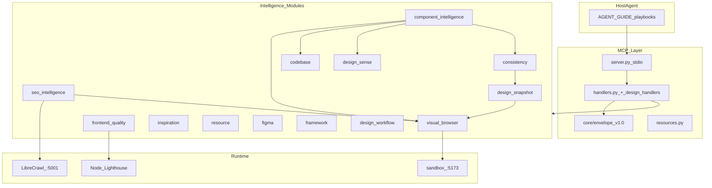
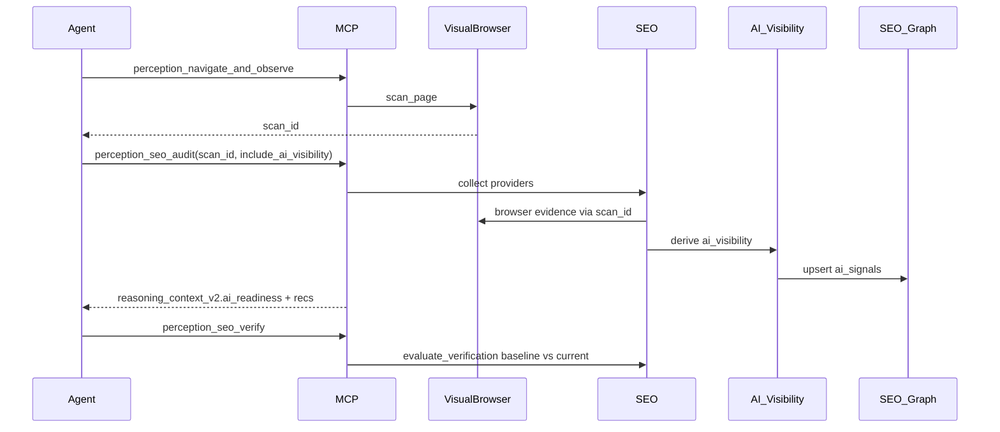

# Frontend Perception MCP — Production Master Test Plan

## Scope and goals

**In scope:** The full `frontend-perception-engine` stack — MCP server ([`src/navigation/mcp/server.py`](src/navigation/mcp/server.py)), 66 registered tools ([`src/navigation/mcp/tools.py`](src/navigation/mcp/tools.py)), 14 intelligence modules under [`src/navigation/`](src/navigation/), companion services (LibreCrawl), sandbox app (`sandbox/`), agent playbooks ([`AGENT_GUIDE.md`](AGENT_GUIDE.md)), and MCP resources ([`src/navigation/mcp/resources.py`](src/navigation/mcp/resources.py)).

**Out of scope for v1 of this plan:** Live third-party API rank tracking, internet-scale crawls, paid SEO APIs, and production deployment of the MCP package to npm (separate release track).

**Production readiness definition:** An agent can complete every documented playbook end-to-end; every MCP tool returns a valid contract v1.0 envelope; degraded paths are explicit (never silent failure); cross-module bridges produce traceable evidence; and regressions are caught by automated tiers before merge.

---

## Architecture under test

**Universal agent loop (must be testable):** OBSERVE → REASON → ACT → VERIFY → STOP ([`AGENT_GUIDE.md` §0](AGENT_GUIDE.md)).

---

## Test tier model

| Tier | Name | Runtime | Trigger | Existing baseline |
|------|------|---------|---------|-------------------|
| **T0** | Fast unit | &lt;2 min, no browser | Every PR | ~230 pytest functions in [`tests/`](tests/) |
| **T1** | Golden regression | &lt;30 s | PR touching pipelines | SEO golden ([`tests/fixtures/seo_golden/`](tests/fixtures/seo_golden/)), design benchmarks |
| **T2** | MCP handler contract | ~5–10 min, sandbox :5173 | PR touching handlers | [`src/run_mcp_contract_tests.py`](src/run_mcp_contract_tests.py) (~50 checks) |
| **T3** | Phase integration | ~15–30 min | Nightly / pre-release | [`src/run_phase1.py`](src/run_phase1.py)–[`run_phase4.py`](src/run_phase4.py), [`run_hardening.py`](src/run_hardening.py) |
| **T4** | Agent eval smoke | ~3 min | Release gate | [`src/run_mcp_eval_validation_form.py`](src/run_mcp_eval_validation_form.py), [`evals/VALIDATION_FORM_EVAL.md`](evals/VALIDATION_FORM_EVAL.md) |
| **T5** | MCP stdio E2E | ~10 min | Pre-release | **Not implemented** (roadmap gap) |
| **T6** | Cross-module E2E | ~30–60 min | Weekly / pre-release | Partial (component contracts, SEO+scan_id) |
| **T7** | Failure / chaos | Variable | Pre-release | Minimal |
| **T8** | Performance / soak | Hours | Monthly | None |

**Recommended CI (to add):** T0+T1 always; T2+T4 on `ubuntu-latest` with sandbox dev server in background; T3 nightly; T5–T8 manual gates before production tag.

---

## Priority framework

| Priority | Meaning | Gate |
|----------|---------|------|
| **P0** | Ship blocker — broken core loop, data loss, security, silent wrong answers | 100% pass required |
| **P1** | Production feature — module/tool must work with documented degraded paths | ≥95% pass; documented skips only |
| **P2** | Cross-module / advanced workflows — high value, some external deps | ≥90% pass; explicit degraded[] |
| **P3** | Polish — performance, docs parity, edge UX | Track issues; no release block |

---

## P0 — Ship blockers (execute first)

### P0.1 MCP contract and transport

| ID | Test | Method | Pass criteria |
|----|------|--------|---------------|
| P0.1.1 | Envelope shape | Unit + contract | Every tool returns `contract_version: "1.0"`, `tool`, `ok`, `session_id`/`run_id` where applicable, `degraded[]`, `data` |
| P0.1.2 | Unknown tool | Contract | `{ ok: false, error: "unknown tool: ..." }` |
| P0.1.3 | Unhandled exception | Contract | Top-level catch → `ok: false`, no stack trace leak to client |
| P0.1.4 | Verify semantics | Contract | `perception_verify` returns `ok: true` envelope even when `data.verified: false` |
| P0.1.5 | No planning hints | Eval | Responses must not contain `suggested_next`, prescriptive "you should" strings ([`run_mcp_eval_validation_form.py`](src/run_mcp_eval_validation_form.py)) |
| P0.1.6 | MCP stdio smoke | **New T5** | Spawn `python -m navigation.mcp`, `list_tools` count ≥66, call `perception_health` + `perception_seo_status`, valid JSON |

**Gap:** T5 stdio E2E does not exist; orphan handlers `perception_resource_pattern_search` / `perception_resource_animation_search` are in [`server.py`](src/navigation/mcp/server.py) but missing from [`tools.py`](src/navigation/mcp/tools.py) — add tool schemas or remove dispatch.

### P0.2 Session and browser lifecycle

| ID | Test | Method | Pass criteria |
|----|------|--------|---------------|
| P0.2.1 | Bootstrap | Contract + eval | `health` → `session_start` → work → `session_end` |
| P0.2.2 | Invalid session | Contract | Missing/unknown `session_id` → clear error, no hang |
| P0.2.3 | Double session_end | Contract | Idempotent or explicit error |
| P0.2.4 | Server shutdown | Integration | `async_main` teardown: `SessionStore` closed, SEO companions stopped ([`server.py`](src/navigation/mcp/server.py)) |
| P0.2.5 | Headless stability | Phase 1–4 | All phase reports `ok: true` with `--headless` |

### P0.3 Core perception loop (AGENT_GUIDE §0–2)

| ID | Test | Method | Pass criteria |
|----|------|--------|---------------|
| P0.3.1 | Navigate + observe | Contract | `scan_id`, `agent_summary`, DOM/a11y present |
| P0.3.2 | Verify negative/positive | Contract | Already in contract suite |
| P0.3.3 | Diff + resources | Contract | `perception_diff`, `perception://scan/{id}/report.json`, screenshots |
| P0.3.4 | Blocking vs advisory | Unit + observe | `agent_summary.blocking` populated on console error / 4xx |
| P0.3.5 | Page inspection E2E | New agent eval | Agent completes §2 on sandbox home route with verify |

### P0.4 Safety and human gates

| ID | Test | Method | Pass criteria |
|----|------|--------|---------------|
| P0.4.1 | Auth gate | Phase 1 + contract | `/login` → `requires_human: true`; agent must not loop |
| P0.4.2 | Form probe | Eval §4 | `perception_probe_form` before fill; invalid then valid submit |
| P0.4.3 | Route guards | Phase 2 | Anonymous `/dashboard` → redirect; admin route blocked |
| P0.4.4 | Credential handling | Unit + manual | OAuth tokens in `.cache/`, never in envelope `data`; PAT not logged |

---

## P1 — Per-module and per-tool coverage

### P1.A Visual & Browser Intelligence (9 tools)

| Tool | Contract | Unit | Integration | Notes |
|------|----------|------|-------------|-------|
| `perception_health` | Yes | Add | — | Unreachable URL handling |
| `perception_session_start/end` | Yes | Add | Phase 1 | Viewport override (§8) |
| `perception_navigate` | Yes | — | Phase 1 | |
| `perception_navigate_and_observe` | Yes | — | Phase 1 | `summary_only`, `budget`, screenshot modes |
| `perception_observe` | Yes | — | Phase 1 | |
| `perception_execute_script` | Yes | — | Phase 1 | `capture_insights_during` |
| `perception_execute_actions` | Yes | — | Eval §4 | click/fill types |
| `perception_verify` | Yes | Add | Eval | `js_assertions`, failure screenshot |
| `perception_diff` | Yes | — | Contract | Visual diff images |

**New tests:** Unit tests for [`visual_browser_intelligence/observe/`](src/navigation/visual_browser_intelligence/), [`verify/`](src/navigation/visual_browser_intelligence/verify/), [`auth_gate`](src/navigation/design_workflow_intelligence/) — currently only contract-covered.

### P1.B Frontend Quality Intelligence (11 tools)

| Tool | Contract | Unit | Integration |
|------|----------|------|-------------|
| `perception_console_get/clear` | Yes | Yes | Contract |
| `perception_network_get/clear` | Yes | Yes | Contract + HAR resource |
| `perception_audit_*` (4) | Partial skip | Parser | Lighthouse available |
| `perception_full_diagnosis` | Yes | Reports | Contract |
| `perception_debug_mode` | Yes | — | Contract |
| `perception_audit_mode` | **Gap** | — | Add to contract suite |

**New tests:** Commit or generate [`artifacts/test-lighthouse.json`](artifacts/test-lighthouse.json) so [`test_audits_parser.py`](tests/test_audits_parser.py) never soft-skips; add `audit_mode` to contract runner.

### P1.C Design Workflow Intelligence (8 tools)

| Tool | Contract | Phase | Notes |
|------|----------|-------|-------|
| `perception_auth_gate` | Yes | 1 | |
| `perception_probe_form` | Yes | 1 | Only `form: "validation"` supported — test rejection of unknown form |
| `perception_probe_guards` | Yes | 2 | `maze` vs `routes` modes |
| `perception_state_save/restore/list` | Yes | 2 | Cookie + storage round-trip |
| `perception_flow_describe` | Partial | 3 | List flows + describe `validation-form` |

**Gap:** No pytest for [`design_workflow_intelligence/`](src/navigation/design_workflow_intelligence/).

### P1.D Codebase Intelligence (1 tool)

| Tool | Tests |
|------|-------|
| `perception_code_context` | Contract (stats); **add** search/get_route with temp repo fixture |

### P1.E Framework Intelligence (2 tools)

| Tool | Tests |
|------|-------|
| `perception_detect_framework` | Contract; sandbox `package.json` detection |
| `perception_framework_docs` | Contract with graceful `degraded` when Grounded Docs unavailable |

### P1.F Component Intelligence (5 tools)

| Tool | Tests |
|------|-------|
| `perception_plan_component_search` | **Add contract** |
| `perception_search_components` | Contract (graceful degraded) |
| `perception_select_component_foundation` | **Add contract** |
| `perception_integrate_component` | **Add contract** (dry-run: `execute_install=false`) |
| `perception_probe_form` | Shared with workflow |

**Existing:** [`test_component_contracts.py`](tests/test_component_contracts.py), [`test_component_search.py`](tests/test_component_search.py), [`test_component_orchestrator.py`](tests/test_component_orchestrator.py).

### P1.G Inspiration Intelligence (3 tools + resource)

| Tool | Tests |
|------|-------|
| `perception_inspiration_discover` | Contract |
| `perception_inspiration_collect` | **Add contract** (blob TTL, session_end cleanup) |
| `perception_inspiration_session_end` | **Add contract** |
| Resource `perception://inspiration-guide` | Contract |

**Existing:** [`test_inspiration_intelligence.py`](tests/test_inspiration_intelligence.py) (17 tests).

### P1.H Resource Intelligence (11 tools + resource)

| Tool | Contract today | Add |
|------|----------------|-----|
| `perception_resource_search` | Yes | License filter edge cases |
| `perception_resource_preview` | **No** | Contract + blob cleanup |
| `perception_resource_icon/font/logo/photo/avatar/illustration_search` | Partial | Full category shortcuts |
| `perception_resource_pattern_search` | **Orphan** | Register in tools.py or remove |
| `perception_resource_animation_search` | **Orphan** | Same |
| `perception_resource_license_check` | Partial | Invalid asset object |
| `perception_resource_observe_bridge` | **No** | Requires `scan_id` from observe |
| `perception_resource_session_end` | **No** | TTL expiry |
| Resource `perception://resource-guide` | Yes | |

**Existing:** [`test_resource_intelligence.py`](tests/test_resource_intelligence.py) (18 tests).

### P1.I SEO Intelligence (5 tools + resource)

| Tool | Tests |
|------|-------|
| `perception_seo_status` | Contract; assert `ai_visibility` block in status |
| `perception_seo_audit` | Contract; **add** `include_ai_visibility: true/false` matrix |
| `perception_seo_connect` | **Add contract** (setup action, no OAuth in CI) |
| `perception_seo_query` | **Add contract** — `graph.summary`, `page.issues`, `ai.readiness.summary`, `page.ai_readiness` |
| `perception_seo_verify` | **Add contract** with mocked baseline |
| Resource `perception://seo-guide` | Contract |

**Existing:** Richest suite — [`test_seo_*.py`](tests/), AI visibility ([`test_ai_visibility_*.py`](tests/)), companions ([`test_companion_*.py`](tests/)), golden fixtures.

**Companion LibreCrawl (P1):**

| ID | Test | Pass criteria |
|----|------|---------------|
| P1.I.1 | Health probe | `ensure_companions_ready` returns healthy on Windows UTF-8 |
| P1.I.2 | Guest/session auth | No 401 on subsequent API calls |
| P1.I.3 | Crawl evidence | `normalize_crawl_payload` → graph upsert |
| P1.I.4 | Degraded audit | Audit completes with `degraded` when LibreCrawl down, not crash |
| P1.I.5 | LOCAL_MODE | No guest rate limits in local dev |

### P1.J Figma Intelligence (3 tools + resource)

| Tool | Tests |
|------|-------|
| `perception_figma_status` | **Add contract** |
| `perception_figma_connect` | Unit with `monkeypatch` ([`test_figma_connection.py`](tests/test_figma_connection.py)) |
| `perception_figma_context` | Unit; contract with mock PAT |
| Resource `perception://figma-guide` | **Add contract** |

### P1.K Design / Consistency pipeline (9 tools) — **largest contract gap**

| Tool | Contract | Unit | Notes |
|------|----------|------|-------|
| `perception_build_design_snapshot` | **No** | Yes ([`test_design_snapshot_engine.py`](tests/test_design_snapshot_engine.py)) | From `scan_id` |
| `perception_design_review` | **No** | Partial | [`test_design_sense_intelligence.py`](tests/test_design_sense_intelligence.py) |
| `perception_consistency_review` | **No** | Phase tests | |
| `perception_consistency_audit` | **No** | Phase tests | |
| `perception_design_knowledge_query` | **No** | Yes (consistency phase) | |
| `perception_design_graph_summary` | **No** | Yes | |
| `perception_design_graph_refresh` | **No** | Discovery tests | |
| `perception_consistency_assess` | **No** | Yes | |
| `perception_consistency_propose_fix` | **No** | Yes | |

**Partial:** [`test_design_mcp_handlers.py`](tests/test_design_mcp_handlers.py) (3 tests) — expand to full handler matrix.

**Docs gap:** No `perception://design-guide` resource; design tools absent from [`AGENT_GUIDE.md`](AGENT_GUIDE.md) and [`docs/tool_reference.md`](docs/tool_reference.md) — add playbook §19 or fix docs as part of test prep.

---

## P2 — Cross-module integration matrix

| ID | Flow | Modules | Test method |
|----|------|---------|-------------|
| P2.1 | SEO audit with live page | SEO → Browser (`scan_id`) → graph | Integration: audit with `scan_id` from observe |
| P2.2 | AI visibility pipeline | SEO providers → AI adapter → recommendations → verify | Golden + live audit on strikeloop-like fixture |
| P2.3 | Resource observe bridge | VB → scan → resource icon search | Contract: `perception_resource_observe_bridge` |
| P2.4 | Component foundation selection | Component → Framework + Codebase + Design Sense + Consistency + Browser | [`test_component_contracts.py`](tests/test_component_contracts.py) + E2E dry-run |
| P2.5 | Design snapshot → review → consistency | VB → Snapshot → Design Sense + Consistency PDG | Scenario runner + MCP handlers |
| P2.6 | Figma → PDG discovery | Figma → Consistency discovery pipeline | Mock Figma context → graph refresh |
| P2.7 | Inspiration → reference registry | Inspiration → Design Reference Registry | Scaffold — expect `degraded` until wired |
| P2.8 | Codebase ↔ UI correlation | Code context + observe same route | AGENT_GUIDE §10 playbook eval |
| P2.9 | SEO codebase hints | SEO reasoning + `repo_root` | Sprint 2 tests + audit with `repo_root` |
| P2.10 | Lighthouse SEO vs SEO Intelligence | FQ `perception_audit_seo` vs `perception_seo_audit` | Document disambiguation; both return valid distinct payloads |

---

## P2 — Agent playbook E2E scenarios

Each scenario is a **scripted agent eval** (human or automated) mapped to [`AGENT_GUIDE.md`](AGENT_GUIDE.md) sections.

| ID | Playbook | Sandbox route / setup | Automated today |
|----|----------|----------------------|-----------------|
| E2E-1 | §1 Bootstrap | Any | Partial (contract health+session) |
| E2E-2 | §2 Page inspection | `/` or component page | **New** |
| E2E-3 | §3 Debugging | Inject console error page | **New** |
| E2E-4 | §4 Forms | `/forms/validation` | **Yes** ([`VALIDATION_FORM_EVAL.md`](evals/VALIDATION_FORM_EVAL.md)) |
| E2E-5 | §5 Navigation | Maze routes | Phase 2 |
| E2E-6 | §6 Multi-step flows | `validation-form` flow | Phase 3 |
| E2E-7 | §7 Regression only | Baseline scan compare | **New** |
| E2E-8 | §8 Viewport | `session_start` viewport | **New** |
| E2E-9 | §9 Edge UI | `/edge-lab` | Phase 4 |
| E2E-10 | §10 Code ↔ UI | `code_context` + observe | **New** |
| E2E-11 | §13 Inspiration | Query only (no install) | **New** |
| E2E-12 | §14 Resources | Icon search + license | Partial (contract) |
| E2E-13 | §15 SEO dev mode | `perception_seo_audit` no auth | Contract (basic) |
| E2E-14 | §15 SEO professional | GSC OAuth (manual/staging) | Manual only |
| E2E-15 | §16 Figma | PAT in env (manual) | Manual |
| E2E-16 | Design review | Snapshot + design_review | **New** |
| E2E-17 | AI visibility fix loop | Audit → fix meta/schema → verify | **New** (strikeloop-like) |

**Eval artifact standard:** Each E2E produces `artifacts/evals/{scenario_id}/report.json` with tool call trace, pass/fail per step, final `verified` and `blocking` state.

---

## P2 — Failure, recovery, and degraded-mode scenarios

| ID | Scenario | Expected behavior |
|----|----------|-------------------|
| F1 | Dev server down | `perception_health` → `ok: false`; clear error message |
| F2 | Browser crash mid-session | Next tool call fails gracefully; no zombie lock |
| F3 | Lighthouse/Node missing | Audits `degraded: ["lighthouse_unavailable"]`; audit still `ok: true` |
| F4 | LibreCrawl down | SEO audit completes; `degraded` notes; no companion bootstrap hang |
| F5 | LibreCrawl 401 / session loss | Auto re-auth; crawl succeeds on retry |
| F6 | Windows cp1252 console | LibreCrawl companion logs UTF-8 without crash |
| F7 | OAuth cancelled | `perception_seo_connect` → actionable error, no partial token |
| F8 | SEO auth required in pro mode | `perception_seo_audit` → `error: auth_required` + prompts |
| F9 | Figma not connected | `perception_figma_context` → `figma_not_connected` |
| F10 | External provider timeout (inspiration/resource) | `ok: true` with `degraded`; empty results, not exception |
| F11 | Invalid tool arguments | Early validation error in envelope |
| F12 | Scan expired / unknown scan_id | Resource read fails cleanly |
| F13 | `include_ai_visibility=false` | No `ai_readiness` block; no `ai_visibility` recs |
| F14 | Insufficient evidence for AI analyzer | `degraded: ai_readiness_insufficient_evidence:{id}`; score excludes skipped |
| F15 | Verify failure | Failure screenshot attached; diff guidance in `reasons` |
| F16 | Disk full / cache write fail | Graph save error surfaced; no silent data loss |

---

## P3 — Performance, reliability, UX, and docs parity

### Performance budgets (initial targets — tune after baseline run)

| Area | Metric | Target |
|------|--------|--------|
| `perception_observe` (summary_only) | p95 latency | &lt;8 s |
| `perception_navigate_and_observe` (full + screenshot) | p95 | &lt;15 s |
| `perception_seo_audit` (dev mode, companions warm) | p95 | &lt;120 s |
| `perception_seo_audit` (companions cold start) | p95 | &lt;300 s |
| `perception_full_diagnosis` | p95 | &lt;180 s (with audits) |
| MCP contract suite (T2) | Total wall time | &lt;10 min |
| Memory per session | After 20 observes | No unbounded growth (scan registry eviction) |

### Reliability / soak

| ID | Test | Duration |
|----|------|----------|
| R1 | 50× observe → verify loop same session | 30 min |
| R2 | 10 sequential SEO audits same site | 1 hr |
| R3 | Blob store TTL cleanup (inspiration + resource) | Unit + timed |
| R4 | Graph file corruption recovery | Truncate `seo_graph.json` → graceful error |

### UX / agent experience

| ID | Check |
|----|-------|
| U1 | Every tool description matches handler behavior |
| U2 | `agent_summary.blocking` always before `advisory` in docs and responses |
| U3 | Tool count in Cursor MCP config matches codebase (66 vs 18 deployed gap) |
| U4 | All 6 static resources readable and non-empty |
| U5 | `perception_audit_seo` vs `perception_seo_audit` disambiguation in guides |
| U6 | Design/consistency tools documented or marked experimental |

### Documentation parity audit

Cross-check: [`tools.py`](src/navigation/mcp/tools.py) ↔ [`handlers.py`](src/navigation/mcp/handlers.py) ↔ [`server.py`](src/navigation/mcp/server.py) ↔ [`docs/tool_reference.md`](docs/tool_reference.md) ↔ [`AGENT_GUIDE.md`](AGENT_GUIDE.md) ↔ [`resources.py`](src/navigation/mcp/resources.py).

---

## MCP tool coverage checklist (66 tools)

**Legend:** C=contract suite today, U=unit tests, E=E2E eval planned

| # | Tool | C | U | E | Priority |
|---|------|---|---|---|----------|
| 1–9 | Core perception loop (health…diff) | C | partial | E2E-2 | P0 |
| 10–17 | Workflow (auth…flow) | C | gap | E2E-4–6 | P0–P1 |
| 18 | code_context | C | gap | E2E-10 | P1 |
| 19–22 | console/network | C | U | — | P1 |
| 23–26 | lighthouse audits | C* | U | — | P1 |
| 27–29 | diagnosis modes | C | partial | — | P1 |
| 30–31 | framework | C | U | — | P1 |
| 32–35 | component | partial | U | E2E new | P1 |
| 36–38 | inspiration | partial | U | E2E-11 | P1 |
| 39–49 | resource | partial | U | E2E-12 | P1 |
| 50–54 | seo | partial | U | E2E-13/17 | P0–P1 |
| 55–57 | figma | gap | U | E2E-15 | P1 |
| 58–66 | design/consistency | gap | U | E2E-16 | P1 |

\*Skipped when Lighthouse unavailable — must remain explicit skip, not false pass.

---

## Execution roadmap (after approval)

### Wave 1 — Foundation (Week 1)
- Wire CI: T0 pytest + T1 golden on every PR
- Fix P0 gaps: stdio smoke (T5), orphan tool registration, `audit_mode` in contract
- Expand contract suite: design handlers (9), figma (3), seo_query/verify/connect, resource gaps
- Document execution commands in [`STAGES.md`](STAGES.md) test matrix appendix

### Wave 2 — Module depth (Week 2)
- Add visual_browser unit tests (observe, verify, auth_gate)
- SEO matrix: `include_ai_visibility`, graph queries `ai.readiness.*`, companion failure modes (F4–F6)
- Component integrate dry-run contract
- New E2E evals: E2E-2, E2E-7, E2E-10, E2E-17

### Wave 3 — Cross-module + failure (Week 3)
- P2 integration flows (scan_id → SEO, observe → resource bridge, snapshot → design review)
- Failure scenario suite F1–F16 as pytest markers or dedicated runner
- Nightly T3 `run_all_phases.py` in CI

### Wave 4 — Production gate (Week 4)
- Performance baseline + budgets (P3)
- Soak tests R1–R4 (staging)
- Docs parity audit (U6)
- Release checklist sign-off: all P0 green, P1 ≥95%, P2 documented

---

## Test infrastructure improvements (prerequisites)

1. Add `[tool.pytest.ini_options]` to [`pyproject.toml`](pyproject.toml): `pythonpath = ["src"]`, markers `unit`, `golden`, `contract`, `integration`, `slow`, `manual`
2. Add [`.github/workflows/test.yml`](.github/workflows/test.yml): T0+T1 always; T2+T4 with sandbox job
3. Create `src/run_mcp_contract_tests_design.py` or extend existing runner with design/figma/seo_query sections
4. Create `evals/` scenario templates mirroring [`VALIDATION_FORM_EVAL.md`](evals/VALIDATION_FORM_EVAL.md)
5. Standard report format: `artifacts/{suite}/report.json` with `ok`, `tests`, `duration_ms`, `environment`

---

## Production release gate (sign-off criteria)

| Gate | Requirement |
|------|-------------|
| **G1** | T0 + T1: 100% pass |
| **G2** | T2 contract: 100% pass (skips only for documented optional deps) |
| **G3** | T4 validation-form eval: pass |
| **G4** | T3 phase 1–4 + hardening: pass on Windows + Linux |
| **G5** | All P0 scenarios pass |
| **G6** | P1 tool coverage: ≥95% with contract or unit test |
| **G7** | No orphan handlers; tool_reference matches tools.py |
| **G8** | E2E-4, E2E-13, E2E-17 automated |
| **G9** | Failure scenarios F1, F4, F8, F13 documented and tested |
| **G10** | Performance baselines recorded; no p95 regression &gt;20% vs baseline |

---

## Known pre-existing issues to track (not introduced by this plan)

- [`test_compose_confidence_multi_provider`](tests/test_seo_evidence_first.py) threshold failure (Provider Agreement v2)
- Cursor deployed MCP may expose 18 tools vs 66 in repo — verify package publish alignment
- `design_reference_registry` and inspiration/figma reference bridges are scaffold-only
- `perception_integrate_component` install/repair phases partially scaffolded
