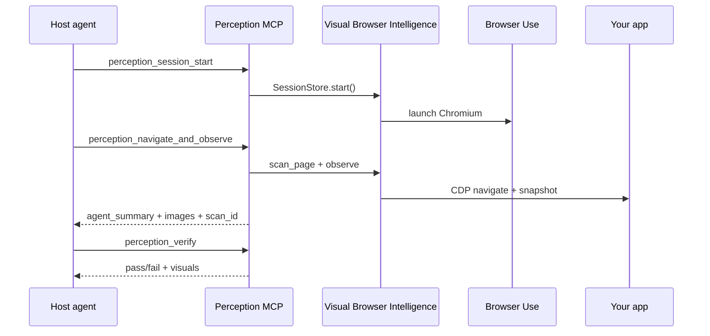

# Architecture

**Packages:** `frontend-perception-engine`, `frontend-mcp` (alias)  
**MCP server version:** 0.11.0  
**Python package version:** 0.2.0+

> **See also:** [INTELLIGENCE_MODULES.md](./INTELLIGENCE_MODULES.md) — the canonical map of all seven intelligence modules.

## North star

The **ultimate Frontend MCP** for AI coding agents: perception, debugging, verification, and workflow — not a BrowserTools clone, not a Playwright wrapper, not an autonomous browser agent.

```text
Cursor / Claude / Codex  (brain — plans, edits code)
        ↓
Frontend Perception MCP  (deterministic runtime — no LLM)
        ↓
Seven Intelligence Modules + Core
        ↓
Browser Use + CDP        (Chromium control)
        ↓
Your app (localhost or deployed)
```

## Intelligence module layout (v0.11)

```text
src/navigation/
├── core/                         # envelope, scan registry, CDP hub, budgets
├── framework_intelligence/       # 1 — stack detection + Context7 docs
├── component_intelligence/       # 2 — component probes + providers (scaffold)
├── design_workflow_intelligence/ # 3 — flows, state, auth, exploration
├── visual_browser_intelligence/  # 4 — observe, verify, browser, agent
├── codebase_intelligence/        # 5 — CRG graph, code context
├── frontend_quality_intelligence/# 6 — console, network, audits, diagnosis
├── design_sense_intelligence/    # 7 — visual heuristics, UX hints
├── mcp/                          # MCP server (thin handlers)
└── cli/
```

Legacy paths (`perception/`, `console/`, `codeGraph/`, `browser_use/`, etc.) are **import shims** — prefer intelligence module imports for new code.

## Core principles

1. **Deterministic MCP** — tools return facts; playbooks live in `AGENT_GUIDE.md`.
2. **Modular intelligence** — extend one module without touching unrelated code.
3. **Provider abstraction** — external services (Context7, Lighthouse, CRG) behind provider interfaces.
4. **CDP-first** — console, network, screenshots, audits via Chrome DevTools Protocol.
5. **Verify before done** — `perception_verify` + `perception_diff` are first-class.

## Session lifecycle



## Related

- [INTELLIGENCE_MODULES.md](./INTELLIGENCE_MODULES.md)
- [tool_reference.md](./tool_reference.md)
- [roadmap.md](./roadmap.md)
