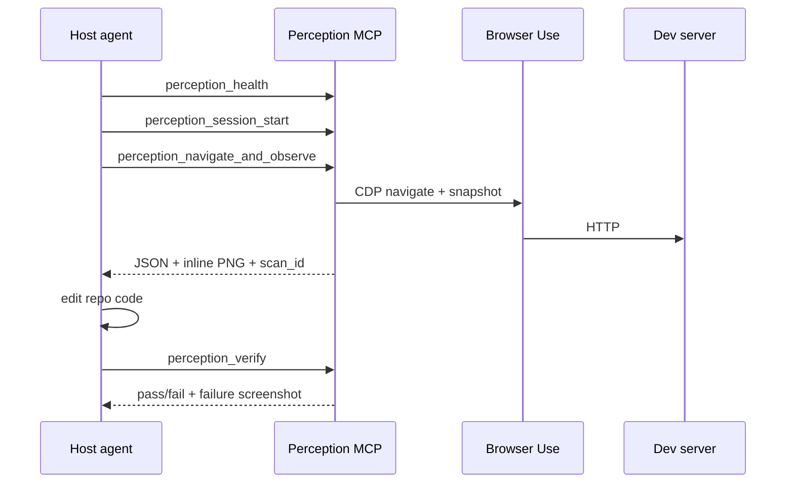

# Frontend MCP — Architecture

**Packages:** `frontend-perception-engine`, `frontend-mcp` (alias)  
**MCP server version:** 0.5.0 (inline visual delivery)  
**Python package version:** 0.2.0+

## North star

The **ultimate Frontend MCP** for AI coding agents: perception, debugging, verification, and workflow — not a BrowserTools clone, not a Playwright wrapper, not an autonomous browser agent.

```
Cursor / Claude / Codex  (brain — plans, edits code)
        ↓
Frontend Perception MCP  (deterministic runtime — no LLM)
        ↓
Browser Use + CDP        (Chromium control)
        ↓
Your app (localhost or deployed)
```

## What we are NOT

- Chrome extension + WebSocket middleware (see `references/browser-tools-mcp`)
- A second browser agent with its own LLM loop (Browser Use Agent path is optional/demo only)
- A flat bag of unrelated scripts

## Core principles

1. **Deterministic MCP** — tools return facts; playbooks live in `AGENT_GUIDE.md` + MCP instructions.
2. **CDP-first** — console, network, screenshots, audits via Chrome DevTools Protocol.
3. **Managed sessions** — `perception_session_start` owns Chromium; future: attach-to-existing-Chrome mode.
4. **Structured reports** — agents consume `agent_summary`, `visual`, scan artifacts — not raw log dumps.
5. **Verify before done** — `perception_verify` + `perception_diff` are first-class.

## Current layout (v0.2)

Code lives under `src/navigation/` while we migrate toward modular packages:

```
src/navigation/
├── mcp/              # MCP server, tools, handlers, envelope, visual_response
├── perception/       # observe, verify, dev_insights, visual_*, flows, state
├── browser_use/      # optional LLM agent integration
├── codeGraph/        # CRG adapter (code ↔ UI)
└── cli/              # install wrapper
```

## Target modular layout (incremental migration)

```
src/navigation/   (→ future top-level package: frontend_mcp)
├── perception/     # observe, scan, preflight, budget
├── browser/          # session lifecycle, CDP hub, attach mode
├── actions/          # execute_script, execute_actions, scripted_actions
├── verification/     # criteria, verify, diff
├── visual/           # capture, annotate, visual_insights, visual_diff
├── audits/           # lighthouse wrappers (planned)
├── debugging/        # console + network full capture (planned)
├── network/          # HAR, request store (planned)
├── console/          # log ring buffer, filters (planned)
├── flows/            # flow_graph, runner
├── state/            # state_manager, auth_gate, route_guards
├── code_context/     # codeGraph adapters
├── reports/          # diagnosis orchestration, report schema (planned)
├── artifacts/        # scan registry, paths, resources
├── plugins/          # optional backends (planned)
└── shared/           # models, envelope, utils
```

Each module: `models.py` / `views.py`, `service.py`, tests, `docs/features/*.md`.

**Rule:** new features go in the target module; thin MCP handlers in `mcp/handlers.py` delegate to services.

## Session lifecycle



## Data artifacts

| Artifact | Storage | MCP delivery |
|----------|---------|--------------|
| `scan_id` | `ScanRegistry` in-memory | JSON envelope |
| Screenshots | `artifacts/<session>/images/` | Inline `ImageContent` + `perception://scan/{id}/screenshot*.png` |
| Observation JSON | `ScanRecord.observation` | `detail: full` or resources |
| Diff images | `artifacts/.../diffs/` | Inline on `perception_diff` |

## Reference integration

Study `references/browser-tools-mcp/` for:

| Reference area | Our reimplementation path |
|----------------|---------------------------|
| Extension console capture | `console/` + CDP `Runtime` + `Log` |
| Extension network capture | `network/` + CDP `Network` + HAR export |
| Lighthouse audits | `audits/` wrapping Lighthouse CLI or programmatic API |
| Debugger/Audit mode | `perception_full_diagnosis` in `reports/` |
| Selected DOM element | `screenshot_mode: element` + future `perception_inspect_selector` |

Never depend on their extension or `browser-tools-server`.

## Related docs

- [Integration plan](./INTEGRATION_PLAN.md)
- [Tool reference](./tool_reference.md)
- [Roadmap](./roadmap.md)
- [Design decisions](./design_decisions.md)
- [AGENT_GUIDE.md](../AGENT_GUIDE.md) — agent playbooks
